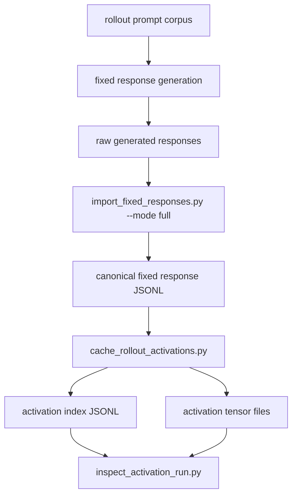

# Activation Cache Runbook

This runbook is the operational bridge from fixed responses to first Pythia activation artifacts.

## Current Flow



## Preflight

Use the repo-local model runtime:

```bash
.venv/bin/python scripts/system/check_model_runtime.py
```

Do not use global `python3` for model runs; the repo-local `.venv` is the verified runtime.

## Step 1: Generate Fixed Responses

Current ungated generator:

```bash
.venv/bin/python scripts/rollouts/generate_fixed_responses.py \
  --provider hf_local \
  --hf-model-id Qwen/Qwen2.5-0.5B-Instruct \
  --variant qwen2.5-0.5b-instruct \
  --run-id qwen2.5-0.5b-full-v0 \
  --local-files-only
```

This writes:

```text
artifacts/runs/assistant_axis_attribution/fixed-response-generator/fixed-aa-rollouts-v0/assistant-axis-rollouts-v0/qwen2.5-0.5b-instruct/qwen2.5-0.5b-full-v0/results/generated_responses_raw.jsonl
```

## Step 2: Import Full Responses

```bash
.venv/bin/python scripts/rollouts/import_fixed_responses.py \
  --input-jsonl artifacts/runs/assistant_axis_attribution/fixed-response-generator/fixed-aa-rollouts-v0/assistant-axis-rollouts-v0/qwen2.5-0.5b-instruct/qwen2.5-0.5b-full-v0/results/generated_responses_raw.jsonl \
  --output-jsonl data/rollouts/assistant_axis_rollouts_v0_responses.jsonl \
  --output-manifest data/rollouts/assistant_axis_rollouts_v0_responses_manifest.json \
  --mode full
```

Required result:

```text
errors = 0
validation.passed = true
output_response_records = 1040
```

## Step 3: Tiny Activation Smoke

Start with the final checkpoint and layer 12:

```bash
.venv/bin/python scripts/activations/cache_rollout_activations.py \
  --response-jsonl data/rollouts/assistant_axis_rollouts_v0_responses.jsonl \
  --revision step143000 \
  --layer 12 \
  --limit 4 \
  --batch-size 1 \
  --run-id activation-smoke-step143000-layer12 \
  --torch-dtype float32 \
  --device-map auto
```

The first smoke uses `--batch-size 1` to isolate token-span and memory problems. Increase batch size only after the smoke passes.

## Step 4: Inspect Activation Run

```bash
.venv/bin/python scripts/activations/inspect_activation_run.py \
  --run-dir artifacts/runs/assistant_axis_attribution/pythia-410m-deduped/fixed-aa-rollouts-v0/assistant-axis-rollouts-v0/response-token-mean-layer12/activation-smoke-step143000-layer12
```

For actual tensor-shape verification:

```bash
.venv/bin/python scripts/activations/inspect_activation_run.py \
  --run-dir artifacts/runs/assistant_axis_attribution/pythia-410m-deduped/fixed-aa-rollouts-v0/assistant-axis-rollouts-v0/response-token-mean-layer12/activation-smoke-step143000-layer12 \
  --load-tensors
```

## What The Inspector Checks

- `meta/status.json` exists.
- `meta/run_manifest.json` exists.
- `checkpoints/progress.json` exists.
- `results/activation_index.jsonl` exists.
- index rows have unique `rollout_id`s.
- every `activation_path` in the index exists.
- response spans satisfy:

```text
response_token_start < response_token_end
response_token_count > 0
response_token_end - response_token_start = response_token_count
```

- optional tensor loading confirms actual `.pt` tensor shapes match index metadata.

## Proceed Gate

Do not build Assistant Axis vectors until:

- the activation smoke completes,
- the inspector passes,
- activation vectors have shape `[1024]`,
- response-token span stats look non-empty and reasonable.
