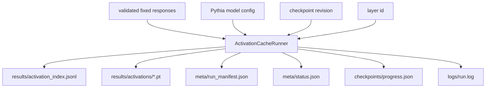

# Activation Cache Runner Design

This document defines the first activation runner for Pythia rollout responses.

## Purpose

The runner turns validated fixed responses into pooled residual-stream activations:

```text
one rollout response
-> one Pythia checkpoint/layer forward pass
-> one response-token mean activation vector
```

For `EleutherAI/pythia-410m-deduped`, the MVP vector shape is:

```text
[1024]
```

## Input Contract

Input response records come from:

```text
scripts/rollouts/import_fixed_responses.py
```

Each record must contain:

- `rollout_id`
- `prompt_text`
- `generated_response`
- role/default metadata

## Token Span Rule

The runner computes token spans per item, not per batch:

```text
prompt_plus_separator = prompt_text + response_separator
full_text = prompt_text + response_separator + generated_response

response_start = len(tokenize(prompt_plus_separator))
response_end = len(tokenize(full_text))
```

Then it pools only:

```text
hidden_states[row, response_start:response_end, :]
```

## Padding Rule

Activation caching uses right padding:

```text
tokenizer.padding_side = "right"
```

This differs from generation, where left padding is useful for decoding completions. For activation caching, right padding keeps each row's real response span at the positions computed before batching.

## Flow



## Hook Choice

The first implementation uses Hugging Face `output_hidden_states=True`.

For causal LM outputs:

```text
hidden_states[0]     = embedding output
hidden_states[L + 1] = output after transformer layer L
```

So layer `12` is read from:

```text
outputs.hidden_states[13]
```

## Resume Contract

On start, the runner reads the activation index and skips a rollout only if:

1. an index row exists for that rollout/checkpoint/layer/pooling policy, and
2. the referenced activation tensor file exists.

Progress metadata alone is not sufficient.

This implements the failure-learning rule from `docs/learning/failure_learning_log.md`.

## Progress Rule

Full activation runs show a live `tqdm` progress bar by default after model download. The progress bar should include completed records, total records, and batch size. Use `--no-progress` only for log-only environments where terminal progress rendering is undesirable.
