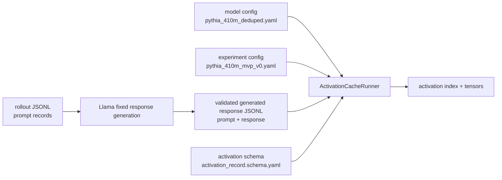

# Activation Config Design

This note explains the config handoff from rollout corpus work to activation extraction.

## Flow



## Why Generated Responses Are Required

The real pooling policy is:

```text
response_token_mean
```

That means activations should be averaged over response tokens only, not over the role/default instruction prefix.

For a record, the model input will eventually look like:

```text
prompt_text + generated_response
```

The activation runner needs token boundaries:

```text
prompt tokens:   [0, prompt_token_count)
response tokens: [response_token_start, response_token_end)
```

Then it pools only:

```text
residual_stream[response_token_start:response_token_end]
```

## New Configs

```text
configs/models/pythia_410m_deduped.yaml
configs/experiments/pythia_410m_mvp_v0.yaml
configs/schemas/activation_record.schema.yaml
```

## Model Config

The model config records stable model facts and runtime defaults:

- repo id,
- tokenizer repo id,
- architecture,
- checkpoint naming,
- layer count,
- hidden size,
- first layer policy.

For Pythia-410M:

```text
layers = 24
hidden_size = 1024
first MVP layer = 12
```

## Experiment Config

The experiment config wires:

- rollout corpus,
- fixed generated response requirement,
- first 8-checkpoint sweep,
- layer 12,
- `response_token_mean`,
- AA construction variants,
- artifact layout,
- completion gates.

## Activation Schema

The activation schema defines one activation index row. It links:

```text
rollout_id
checkpoint_revision
layer
pooling_policy
activation_path
```

It also requires response-token span fields for `response_token_mean`.

## Next Scripts

Before full `ActivationCacheRunner` runs, we need:

```text
data/rollouts/assistant_axis_rollouts_v0_responses.jsonl
```

This should be produced by Llama fixed-response generation and validated with `scripts/rollouts/import_fixed_responses.py --mode full`.

The activation runner now exists:

```text
scripts/activations/cache_rollout_activations.py
```

It should first be run as a tiny smoke test on a validated response subset or the full response JSONL with `--limit 4`.
