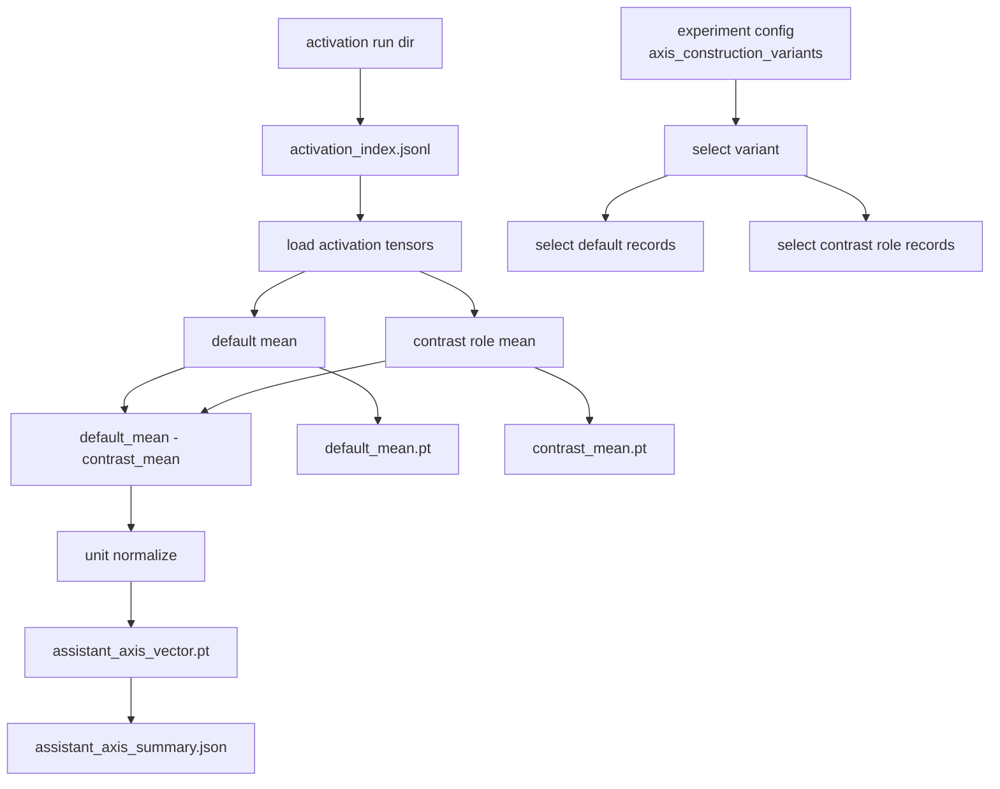
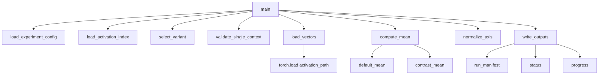

# Assistant Axis Builder Design

This document defines the first vector-building step after activation caching.

## Purpose

The builder turns pooled activation tensors into an Assistant Axis vector:

```text
default_mean - contrast_role_mean
```

For the MVP, this is built at one checkpoint and one layer after `response_token_mean` activation caching succeeds.

## Flow



## MVP Variant

The default variant is `aa_main` from:

```text
configs/experiments/pythia_410m_mvp_v0.yaml
```

It uses:

```yaml
default_prompt_ids:
  - helpful_assistant
  - large_language_model
contrast_role_groups:
  - non_assistant_non_neutral
```

Meaning:

```text
default_mean = mean(default prompt activations for selected default_prompt_ids)
contrast_mean = mean(role activations for selected contrast_role_groups)
aa = normalize(default_mean - contrast_mean)
```

## Inputs

Activation run directory:

```text
artifacts/runs/.../<activation-run-id>/
  results/activation_index.jsonl
  results/activations/*.pt
  meta/run_manifest.json
```

Experiment config:

```text
configs/experiments/pythia_410m_mvp_v0.yaml
```

## Outputs

The builder writes a separate governed run:

```text
artifacts/runs/
  assistant_axis_attribution/
    pythia-410m-deduped/
      fixed-aa-rollouts-v0/
        assistant-axis-rollouts-v0/
          aa-main-layer12/
            <run_id>/
              inputs/
              checkpoints/
              results/
              logs/
              meta/
```

Important files:

```text
results/assistant_axis_vector.pt
results/default_mean.pt
results/contrast_mean.pt
results/assistant_axis_summary.json
meta/run_manifest.json
meta/status.json
checkpoints/progress.json
logs/run.log
```

## Helper Function Map



## Validation Rules

The builder fails if:

- activation index is missing,
- activation rows mix multiple checkpoints, layers, or pooling policies,
- selected default records are absent,
- selected contrast role records are absent,
- any selected activation tensor path is missing,
- activation shapes disagree,
- the unnormalized axis norm is zero.

## Interpretation Boundary

Allowed after this builder:

> At this checkpoint/layer, the default-vs-role activation contrast defines a candidate Assistant Axis.

Not yet allowed:

> This axis has emerged across training.

That requires the checkpoint sweep and trajectory analysis.
