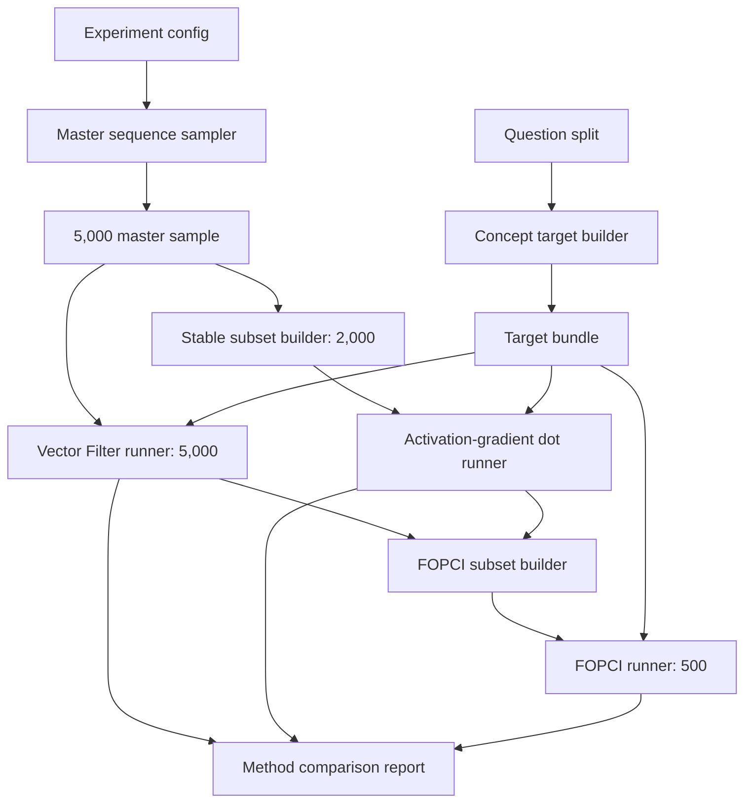

# Concept Attribution Ladder Design

## Purpose

This experiment asks which packed Pythia training sequences in the
`step256 -> step512` window are associated with formation of the Assistant
Axis. It uses three increasingly expensive methods on nested samples:

1. **Vector Filter**: forward-only representational alignment.
2. **Activation-gradient attribution**: first-order loss pressure in the
   layer-12 activation space.
3. **First-order parameter concept influence (FOPCI)**: parameter-gradient
   influence on a held-out Assistant Axis concept score.

The methods are complementary. Vector Filter is a cheap screen,
activation-gradient scoring tests local training pressure at the AA site, and
FOPCI tests a parameter-space first-order query. None alone proves that a
sequence caused the full checkpoint-to-checkpoint rotation.

## Preregistered First Run

| Item | Decision |
| --- | --- |
| Window | `step256 -> step512` |
| Ordered training batches | `batch_idx` 256 through 511 |
| Scoring checkpoint | `step256` |
| Endpoint checkpoint | `step512` |
| Layer/site | residual hidden state, layer 12 |
| Master sample | 5,000 random packed sequences |
| Vector Filter | all 5,000 |
| Activation gradient | deterministic 2,000-sequence subset |
| FOPCI | 500 sequences: 250 random + 250 method-informed |
| Numeric policy | float32 for all gradient methods |
| Primary sequence unit | one packed 2049-token sequence |

The 2,000 and 250 random subsets are selected from the 5,000 master sample
using stable hashes of `sample_id`, not file order. The adaptive FOPCI subset
is selected only after both cheaper methods finish.

The preregistered memberships are materialized with:

```bash
python scripts/data/build_concept_attribution_subsets.py \
  --sample-jsonl <5000-or-larger-step256-to-step512-sample.jsonl> \
  --experiment-config configs/experiments/pythia_410m_concept_attribution_256_512_v0.yaml \
  --run-id subsets-step256-step512-v0
```

The builder uses namespaced SHA-256 ranking, so membership is independent of
input row order and reproducible from the config seed. At this stage only the
250 random FOPCI memberships are frozen; the adaptive 250 remain pending.

## Probe Independence

The 20 shared questions are split before target construction.

### Construction Questions

Used to build the fixed target directions at `step512` and `step143000`:

```text
q000, q036, q091, q186, q151,
q101, q040, q005, q024, q064
```

### Evaluation Questions

Used only to define the live FOPCI concept query at `step256`:

```text
q007, q176, q120, q228, q197,
q167, q119, q170, q081, q125
```

Both halves cover all eight question categories. The primary FOPCI result is
invalid if the same question records construct the fixed axis and evaluate the
live concept score.

## Target Directions

Three named directions are retained:

```text
endpoint_step512:
  AA built at step512 using construction questions only

final_step143000:
  AA built at step143000 using construction questions only

innovation_256_to_512:
  normalize(v512 - projection_of_v512_onto_v256)
```

The native `step256` construction-split axis is diagnostic. Existing
all-question axes are sensitivity references, not primary targets.

## Method 1: Vector Filter

For sequence `x_i`, obtain layer-12 hidden states at `step256` and compute
token projections onto each fixed target:

```text
p_it = h_it dot v_target
```

Save these sequence summaries:

```text
mean projection
maximum projection
top-k mean projection
positive-token fraction
hidden-state norm summaries
```

Raw dot projection is primary. A centered projection using a fixed reference
mean is a sensitivity analysis. Vector Filter says that a sequence expresses a
target direction; it does not say the sequence's training update creates it.

### Main Spine

```text
load config
-> load master sample
-> load step256 model and target bundle
-> forward packed sequences in batches
-> hook layer-12 hidden states
-> project valid tokens onto targets
-> aggregate token projections
-> persist scores/progress/summary
```

## Method 2: Activation-Gradient Dot

For sequence loss `L_i` at `step256`:

```text
u_i = -mean_valid_tokens(dL_i / dh_layer12)
dot_i(v) = u_i dot v
cos_i(v) = cosine(u_i, v)
```

The raw dot is primary because it preserves gradient magnitude. Cosine, update
pressure norm, loss, and token-level summaries remain diagnostics. The runner
must use float32 and define batched loss as a sum of per-sequence mean losses so
scores are invariant to attribution batch size.

### Main Spine

```text
load config
-> select stable 2,000 subset
-> load step256 model and target bundle
-> forward next-token loss
-> retain layer-12 hidden-state gradient
-> backward per-sequence loss
-> pool valid-token update pressure
-> compute target dots, cosines, and norms
-> persist scores and optional pressure vectors
```

## Method 3: FOPCI

Define the held-out live contrast at `step256`:

```text
Delta_eval(theta) = mean(default_eval activations)
                  - mean(contrast_eval activations)

S_target(theta) = v_target dot Delta_eval(theta)
q_target = gradient_theta S_target(theta)
g_i = gradient_theta L_i(theta)

FOPCI_i(target) = - dot(g_i, q_target)
```

The target direction is fixed and detached. The evaluation contrast remains
inside autograd. The raw parameter-gradient dot is primary; gradient cosine and
both norms are secondary diagnostics.

The first run uses the identity-curvature approximation. It does not reconstruct
Pythia optimizer state and does not claim exact historical influence.

### Parameter Scope

`all_parameters` is primary if memory permits. Configured fallbacks are:

```text
layer12_only
upper_half_layers
every_nth_layer
```

Every result records the exact parameter names and count. Results from
different scopes are not silently pooled.

### Main Spine

```text
load config
-> build/load held-out concept query gradient at step256
-> select 250 random + 250 adaptive sequences
-> compute per-sequence parameter gradients
-> stream dot products with each query gradient
-> save raw dots, cosines, norms, scope, and provenance
-> compare with Vector Filter and activation-gradient rankings
```

The implemented runner is invoked with:

```bash
python scripts/analysis/score_first_order_concept_influence.py \
  --sample-jsonl <fopci-random-or-complete-subset.jsonl> \
  --target-bundle <concept-target-bundle-run>/results/concept_target_bundle.json \
  --parameter-scope layer12_only \
  --limit 50 \
  --run-id fopci-layer12-smoke-v0
```

It caches the held-out query-gradient bundle inside the run, validates the
parameter-name/scope hash before reuse, writes each sequence score durably,
and resumes from valid `fopci_scores.jsonl` records. `layer12_only` is the
pilot scope; `all_parameters` remains the preregistered primary scope when
memory permits.

The runner also exposes two optimized modes behind explicit validation gates:

```text
query batching:
  --query-batch-size N

directional per-sequence scoring:
  --sequence-score-mode directional_jvp
  --sequence-batch-size N
```

Query batching preserves globally defined default/contrast weights and
record-local response pooling. Directional scoring computes the primary raw
dot exactly without materializing full per-example gradients; consequently it
does not emit sequence-gradient norms or gradient cosines. Optimized Pythia
runs must match the sequential ten-record reference through
`compare_fopci_query_gradients.py` and `compare_fopci_runs.py` before scaling.

## FOPCI Selection

The 500-sequence set contains:

```text
250 preregistered random sequences
 50 concordant high by Vector Filter and activation-gradient dot
 50 concordant low
 50 Vector-Filter-high / activation-gradient-low disagreement
 50 activation-gradient-high / Vector-Filter-low disagreement
 25 largest endpoint-vs-final target disagreements
 25 near-zero controls on both cheaper methods
```

Adaptive strata use rank percentiles and stable-hash tie breaking. The random
half is reported separately so adaptive selection does not bias method
correlations.

## Component Map



## Planned Components

| Type | Component | Responsibility |
| --- | --- | --- |
| Builder | `build_concept_target_bundle.py` | Build construction-split endpoint/final/native/innovation vectors and evaluation records. |
| Builder | `build_concept_attribution_subsets.py` | Create stable 2,000 random and 500 FOPCI subset manifests. |
| Runner | `score_vector_filter.py` | Forward-only token projections for 5,000 sequences. |
| Runner | `score_training_sequence_gradients.py` | Extend existing runner with primary named dot scores and batch-invariant loss scaling. |
| Runner | `score_first_order_concept_influence.py` | Compute held-out query gradients and per-sequence parameter-gradient dots. |
| Analyzer | `compare_concept_attribution_methods.py` | Correlations, top-k overlap, sign/rank agreement, and target sensitivity. |
| Reporter | `report_concept_attribution_ladder.py` | Tables, plots, examples, limitations, and proceed/pivot gate. |

## Target Bundle Runner

The first implemented component consumes three complete activation runs and
the fixed-response path from the experiment config:

```bash
python scripts/analysis/build_concept_target_bundle.py \
  --experiment-config configs/experiments/pythia_410m_concept_attribution_256_512_v0.yaml \
  --native-activation-run-dir <activation-step256-layer12-run> \
  --endpoint-activation-run-dir <activation-step512-layer12-run> \
  --final-activation-run-dir <activation-step143000-layer12-run> \
  --run-id concept-targets-step256-step512-v0
```

`axis_config`, `axis_variant_id`, and `fixed_response_jsonl` are read from the
experiment config unless explicitly overridden. The output contains four unit
vectors, per-checkpoint default/contrast means, pairwise target cosines, and
the held-out evaluation JSONL.

## Artifact Layout

```text
artifacts/runs/assistant_axis_attribution/
  pythia-410m-deduped/
    pile-deduped-pythia-preshuffled/
      concept-attribution-256-512-v0/
        training-sequence-sample/<run-id>/
        concept-target-bundle-layer12/<run-id>/
        vector-filter-layer12/<run-id>/
        activation-gradient-layer12/<run-id>/
        concept-attribution-subsets/<run-id>/
        fopci/<parameter-scope>/<run-id>/
        method-comparison/<run-id>/
```

Every expensive stage writes `meta/run_manifest.json`, `meta/status.json`,
`checkpoints/progress.json`, structured logs, and result hashes. Completed
sample IDs are resumed rather than recomputed.

## Phases and Gates

1. **C1: Targets and subsets**: build held-out target bundle and 5,000 master sample.
2. **C2: Vector Filter**: score 5,000 and inspect projection distributions.
3. **C3: Activation gradient**: score stable 2,000 with raw dot and cosine.
4. **C4: FOPCI subset**: freeze the 250 random and 250 adaptive IDs.
5. **C5: FOPCI**: run 50-sequence smoke, then 500 if memory/numerics pass.
6. **C6: Comparison**: compare methods separately on random and adaptive subsets.
7. **C7: Causal gate**: choose top/bottom/random sequences for actual short updates.

Proceed to a larger window only if all methods are reproducible, no method has
systematic NaNs, batch-size invariance passes, and FOPCI results are stable to
at least one parameter-scope sensitivity check.

## Claim Boundary

The strongest allowed first-stage claim is:

> At `step256`, these packed sequences have high forward expression,
> activation-gradient pressure, or first-order parameter influence for a
> held-out Assistant Axis target associated with `step512`.

Actual causal formation claims require applying controlled updates and then
remeasuring held-out geometry and behavior.
