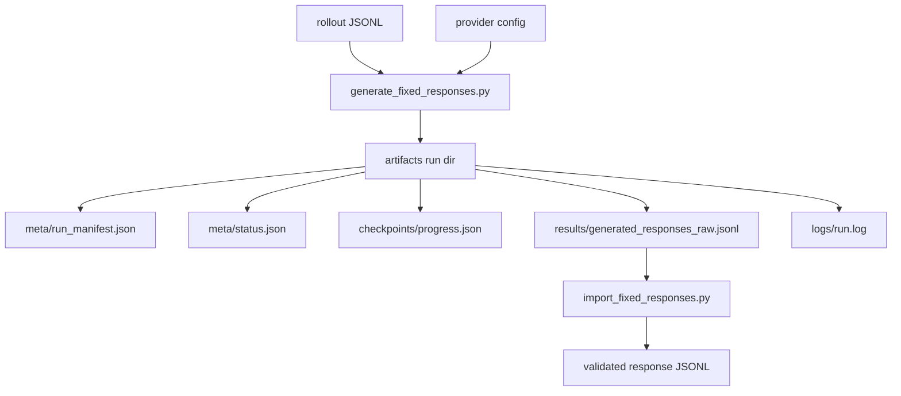
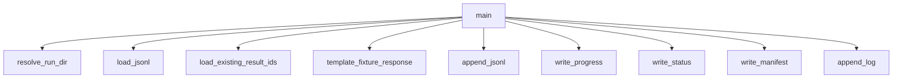

# Fixed Response Generator Design

This document defines the first generator runner for fixed rollout responses.

The generator is separate from the importer:

- generator: produces raw response records and run metadata,
- importer: validates and normalizes raw responses into the fixed response corpus contract.

## Why This Exists

Main activation extraction uses:

```text
response_token_mean
```

That means every rollout needs one frozen response before Pythia checkpoint activations are cached. We should not ask each Pythia checkpoint to generate its own response, because that would mix model behavior changes with activation geometry changes.

## Current Scope

The current runner supports:

```text
provider = template_fixture
provider = hf_local
```

`template_fixture` is for smoke tests of runner state, progress files, and importer compatibility. It is not valid for the final 1040-record scientific corpus.

`hf_local` loads a local/Hugging Face causal language model. The primary VAST fixed-response source is:

```text
meta-llama/Llama-3.2-1B-Instruct
```

This requires Hugging Face gated-model access through `HF_TOKEN` on VAST.

The ungated fallback used for local smoke testing is:

```text
Qwen/Qwen2.5-0.5B-Instruct
```

Later providers can still be added behind the same runner contract:

- API model provider,
- external batch file provider.

## Run Flow



## Artifact Layout

Smoke runs use the same canonical structure as later expensive runs:

```text
artifacts/runs/
  assistant_axis_attribution/
    fixed-response-generator/
      fixed-aa-rollouts-v0/
        assistant-axis-rollouts-v0/
          template-fixture/
            <run_id>/
              inputs/
              checkpoints/
              results/
              logs/
              meta/
```

## Resume Contract

On start, the runner:

1. reads existing `results/generated_responses_raw.jsonl` if present,
2. reads `checkpoints/progress.json` if present,
3. skips rollout ids already present in the result file,
4. appends only missing records,
5. updates `progress.json` after each save interval,
6. marks `meta/status.json` as `completed` only after all selected records are written.

The result JSONL is treated as the source of truth for completed units. Progress metadata is useful but not sufficient by itself.

For `hf_local`, generation is batched with `--batch-size`. On A5000, start with `--batch-size 20`; reduce it if CUDA memory is tight.

## Helper Function Map



## Guardrails

- `template_fixture` requires `--allow-template-fixture`.
- The template provider should be used with `--limit` for smoke tests.
- `hf_local` records model id and generation settings in each response record.
- `hf_local` should use batched generation for full runs.
- Full scientific response generation remains pending until `hf_local` is run over all 1040 rollout records and the output is imported with `--mode full`.

## Llama Command

Full VAST run:

```bash
.venv/bin/python scripts/rollouts/generate_fixed_responses.py \
  --provider hf_local \
  --hf-model-id meta-llama/Llama-3.2-1B-Instruct \
  --variant llama-3.2-1b-instruct \
  --run-id llama-3.2-1b-full-v0 \
  --hf-cache-dir .cache/huggingface \
  --max-new-tokens 192 \
  --batch-size 20 \
  --temperature 0.0 \
  --save-every 25
```

## Qwen Fallback Command

Small access/memory smoke test:

```bash
.venv/bin/python scripts/rollouts/generate_fixed_responses.py \
  --provider hf_local \
  --hf-model-id Qwen/Qwen2.5-0.5B-Instruct \
  --variant qwen2.5-0.5b-instruct \
  --run-id qwen2.5-0.5b-stratified-smoke-v1 \
  --limit 12 \
  --sample-mode stratified \
  --batch-size 4 \
  --local-files-only
```

Full run:

```bash
.venv/bin/python scripts/rollouts/generate_fixed_responses.py \
  --provider hf_local \
  --hf-model-id Qwen/Qwen2.5-0.5B-Instruct \
  --variant qwen2.5-0.5b-instruct \
  --run-id qwen2.5-0.5b-full-v0 \
  --batch-size 20 \
  --local-files-only
```
