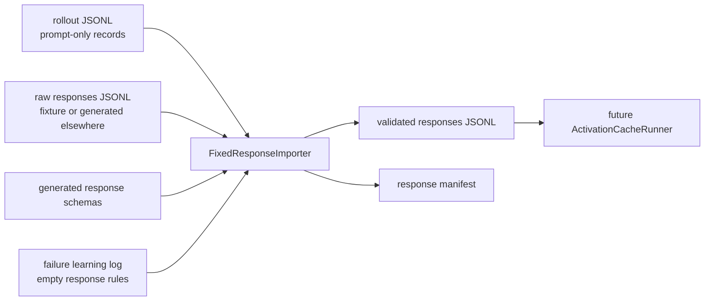
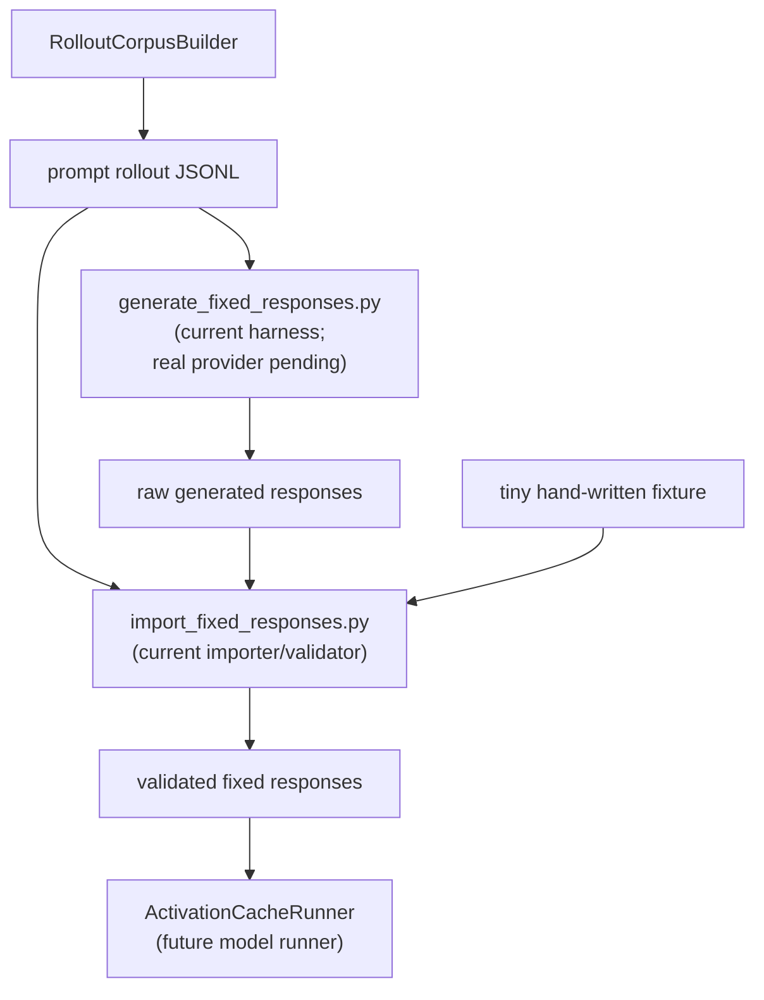
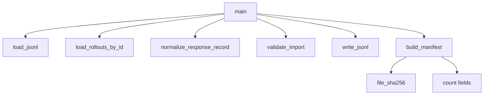

# Fixed Response Import Design

This document defines the first fixed-response step. It validates response records without calling a model.

## Why This Exists

The activation path uses:

```text
response_token_mean
```

So every rollout prompt needs a frozen response. The activation runner will later tokenize:

```text
prompt_text + generated_response
```

and pool only the response-token span.

## Flow



## Builder, Importer, Generator, Runner



The current importer script is a validator/normalizer. The generator harness now exists, but its `template_fixture` provider is only for smoke tests; the final full corpus still needs a real local/API provider or externally generated responses.

## Script

```text
scripts/rollouts/import_fixed_responses.py
```

## Tiny Fixture

```text
data/rollouts/fixtures/fixed_responses_tiny.jsonl
```

The fixture lets us test validation rules without model/API access.

## Failure Rules Imported

From `docs/learning/failure_learning_log.md`:

- empty responses are errors,
- response files need stable ids,
- activation caching should later fail if `full_len <= prompt_len`,
- generated response manifests should count empty responses.

## Output

For fixture testing:

```text
data/rollouts/fixtures/fixed_responses_tiny_validated.jsonl
data/rollouts/fixtures/fixed_responses_tiny_manifest.json
```

For full corpus later:

```text
data/rollouts/assistant_axis_rollouts_v0_responses.jsonl
data/rollouts/assistant_axis_rollouts_v0_responses_manifest.json
```

## Helper Function Map


