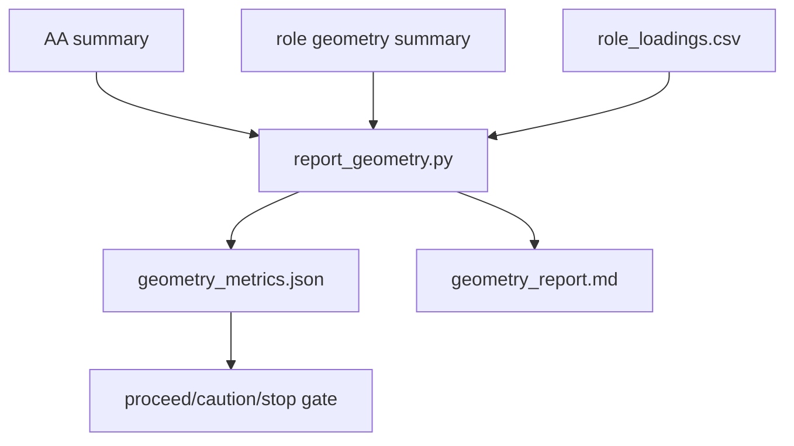

# Geometry Report Design

This document defines the final-checkpoint sanity report before checkpoint sweeps.

## Purpose

The report answers:

```text
Is the final-checkpoint Assistant Axis coherent enough to sweep over training?
```

It does not prove emergence. It only decides whether the target direction is worth tracing.

## Inputs

Assistant Axis run:

```text
<aa-run-dir>/results/assistant_axis_summary.json
<aa-run-dir>/results/assistant_axis_vector.pt
```

Role geometry run:

```text
<role-geometry-run-dir>/results/role_geometry_summary.json
<role-geometry-run-dir>/results/role_loadings.csv
<role-geometry-run-dir>/results/role_pc1.pt
```

## Outputs

```text
results/geometry_report.md
results/geometry_metrics.json
meta/run_manifest.json
meta/status.json
checkpoints/progress.json
logs/run.log
```

## Checks

### AA-PC1 Alignment

Metric:

```text
aa_pc1_cosine = cosine(assistant_axis, role_geometry_pc1)
```

Thresholds:

```text
>= 0.30     proceed
0.15-0.30  caution
< 0.15     stop/revise
```

### PC1 Strength

Metric:

```text
pc1_explained_variance_ratio
```

Thresholds:

```text
>= 0.20     proceed
0.10-0.20  caution
< 0.10     stop/revise
```

### Semantic Loading Sanity

The report lists top absolute loadings on:

```text
PC1
Assistant Axis
```

Expected qualitative pattern:

```text
default prompts and assistant-like roles should not be randomly scattered
non-assistant/non-neutral roles should be meaningfully separated from defaults
neutral controls may be intermediate or mixed
```

This is mostly a human-read gate in the MVP.

### Artifact Completeness

The report checks:

- AA summary exists.
- Role geometry summary exists.
- Loadings CSV exists.
- default and contrast counts are nonzero.
- group count is at least 2.

## Gate Decision

```text
PROCEED
  alignment passes
  PC1 strength passes
  artifacts are complete

CAUTION
  artifacts are complete
  at least one numeric criterion is middling
  human inspection of loadings is needed

STOP
  artifacts are incomplete
  alignment is weak
  PC1 strength is weak
```

## Flow


