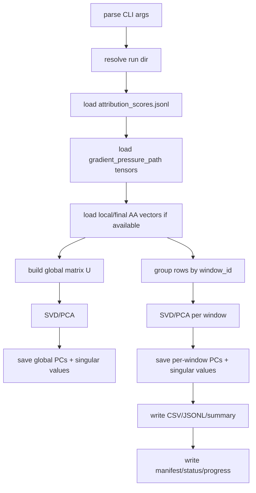

# Gradient Pressure PCA Analyzer Design

## Purpose

Phase 6B analyzes whether the per-sequence gradient pressure from Phase 6A is
low-dimensional and aligned with the Assistant Axis.

It consumes saved update-pressure vectors:

```text
u_i = -mean_tokens(dL_i/dh_layer)
```

and computes PCA/SVD globally and per attribution window.

## Inputs

Required:

```text
<attribution-run-dir>/results/attribution_scores.jsonl
<attribution-run-dir>/results/gradient_pressure_vectors/*.pt
```

Optional:

```text
local Assistant Axis vector
final Assistant Axis vector
```

If axis paths are not passed explicitly, the analyzer tries to read them from:

```text
<attribution-run-dir>/meta/run_manifest.json
```

## Output

Canonical run directory:

```text
artifacts/runs/assistant_axis_attribution/
  pythia-410m-deduped/
    pile-deduped-pythia-preshuffled/
      assistant-axis-attribution-v0/
        gradient-pressure-pca-layer12/
          <run_id>/
            meta/run_manifest.json
            meta/status.json
            checkpoints/progress.json
            results/gradient_pressure_pca_summary.json
            results/gradient_pressure_pca.csv
            results/gradient_pressure_components.jsonl
            results/pcs/*.pt
            results/singular_values/*.pt
            logs/run.log
```

## Main Spine



## PCA Rule

By default the analyzer mean-centers each scope before SVD:

```text
X = U - mean(U)
X = A S V^T
PC_k = V[k]
```

It records:

```text
explained_variance_ratio_k = S_k^2 / sum_j S_j^2
```

For axis comparisons, PCs have arbitrary sign. If an axis is available, the
component is oriented so its cosine with the local axis is non-negative. If no
local axis exists but a final axis exists, it orients against the final axis.

## Interpretation

Useful signals:

```text
high PC1 EVR:
  gradient pressure is low-dimensional

high cos(PC1, AA):
  dominant pressure direction is AA-aligned

large window differences:
  formation windows differ mechanistically
```

This is not a causal intervention. It tells us whether the observed first-order
pressure has a compact structure worth testing causally.
