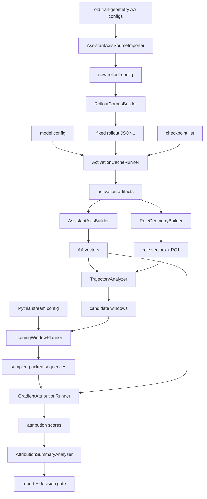

# Repo Build Map

This document explains the repo as a system before the implementation exists. It is based on the useful control surfaces from the earlier trait-geometry project, with a stricter separation between task tracking, object definitions, and run logging.

## Build Philosophy

Every stage follows:

```text
config
-> object model
-> builder / runner / analyzer / gate
-> durable artifact
-> manifest + status + progress
-> read-back validation
-> report or decision
```

The tracker says what is done. This build map says what each thing means.

## Repo Layout

```text
configs/
  experiments/     # experiment-level wiring
  models/          # model and checkpoint configs
  datasets/        # Pythia training-stream configs
  rollouts/        # fixed role/default rollout corpus configs
  schemas/         # record and manifest schemas

data/
  rollouts/        # fixed semantic stimuli
  training_windows/# sampled packed Pythia sequence ids or decoded snapshots

artifacts/
  runs/            # all generated experiment outputs

src/
  assistant_axis_attribution/
    # importable package code, added only when scripts need shared logic

scripts/
  rollouts/        # corpus builders and inspectors
  activations/     # activation caching runners
  analysis/        # vector, geometry, attribution analyzers
  data/            # Pythia stream planning/loading utilities
  steering/        # intervention and validation runners
  reporting/       # plot/report builders

docs/
  design/          # plans, tracker, tasklist, build map
  learning/        # concept notes, practice ladder, and failure learning log
  runbooks/        # operational commands for external compute runs
  manifests/       # run-specific preservation/upload manifest templates
  sources/         # source-backed research notes
  experiments/     # short experiment reports and decision records
```

## Core Objects

`AssistantAxisSourceMaterial`
: Imported source-pinned role instructions and question candidates from the older trait-geometry repo, with old repo paths, source URLs, and hashes recorded. This is an input to the new rollout config, not the final rollout corpus.

`RolloutQuestion`
: A shared semantic question asked under each role/default prompt.

`RoleSpec`
: A role label, group, instruction text, and provenance. Groups are assistant-like, non-assistant/non-neutral, and neutral/control.

`DefaultPromptSpec`
: One of the default Assistant prompt families used to estimate the default assistant mean.

`RolloutRecord`
: One fixed text stimulus with stable id, role/default metadata, question id, prompt text, response text if generated externally, and token-span metadata.

`GeneratedResponseRecord`
: One frozen response attached to a rollout id. This is produced by a generator or external process, then normalized by the fixed-response importer before activation caching.

`OldTraitGridRecord`
: A record from the older trait-geometry Assistant Axis grid. It has role instruction, trait instruction, question, trait axis, and `instruction_*` condition metadata. It is useful as a reference format but should not be used as the main corpus for this project.

`CheckpointSpec`
: A Hugging Face revision such as `step30000`, plus numeric step and checkpoint group.

`ActivationRecord`
: A pooled residual-stream activation for one rollout at one model checkpoint/layer/pooling policy.

`AssistantAxisVector`
: A normalized vector `v_aa_t = mean(default) - mean(role)` at checkpoint `t`, with role inclusion policy recorded.

`RoleVector`
: Mean activation for a single role at a checkpoint.

`RolePC1`
: Leading principal component over role vectors at a checkpoint, oriented so default assistant projects positive.

`TrainingSequence`
: A packed 2049-token sequence from the Pythia preshuffled stream, keyed by `uid`, `batch_idx`, source file, and token ids.

`AttributionScore`
: Per-sequence score containing loss, gradient metadata, `-cos(grad, v_aa_t)`, and `-cos(grad, v_aa_final)`.

`RunManifest`
: Immutable run metadata: config paths and hashes, model/checkpoint, dataset files, layer/pooling policy, artifact paths, git commit if available, and timestamp.

`RunStatus`
: Mutable lifecycle state: `running`, `paused`, `failed`, `completed`, last update time, and current cursor.

`ProgressState`
: Resume cursor and completed unit ids. This is separate from status so scripts can skip completed units.

## Config Inventory

| Config | Purpose | First Consumer |
| --- | --- | --- |
| `configs/experiments/pythia_410m_mvp_v0.yaml` | Wires model, checkpoints, rollout corpus, layers, output root, and sample sizes. | all runners |
| `configs/models/pythia_410m_deduped.yaml` | Stores model repo, tokenizer, checkpoint revision policy, dtype/device defaults. | activation and steering runners |
| `configs/datasets/pythia_preshuffled_stream.yaml` | Stores practical and official training-stream repos plus checkpoint-window mapping rules. | data planners and attribution runner |
| `configs/rollouts/assistant_axis_source_material_v0.yaml` | Stores imported old repo paths, Assistant Axis source URLs, role instruction candidates, and 40-question candidate pool. | rollout config authoring, source importer |
| `configs/rollouts/assistant_axis_roles_v0.yaml` | Stores the new 48 roles, 20 selected questions, 4 default prompts, and external generation policy. | rollout corpus builder |
| `configs/schemas/rollout_record.schema.yaml` | Defines one fixed rollout record. | rollout corpus builder and inspectors |
| `configs/schemas/rollout_manifest.schema.yaml` | Defines the rollout corpus manifest. | rollout corpus builder and inspectors |
| `configs/schemas/generated_response_record.schema.yaml` | Defines one imported/generated fixed response record. | fixed response importer and future generator |
| `configs/schemas/generated_response_manifest.schema.yaml` | Defines fixed response import/generation manifest. | fixed response importer and future generator |
| `configs/schemas/activation_record.schema.yaml` | Defines one activation index row and response-token span requirements. | future activation cache runner |
| `configs/schemas/assistant_axis_vector.schema.yaml` | Defines one normalized Assistant Axis vector artifact. | assistant-axis builder |
| `configs/schemas/role_vector.schema.yaml` | Defines role/default mean vector artifacts. | role geometry builders |
| `configs/schemas/geometry_manifest.schema.yaml` | Defines vector/geometry builder run manifests. | assistant-axis and role-geometry builders |
| `configs/schemas/*.schema.yaml` | Future attribution and run manifest schemas. | validators |

## Source Import From Trait-Geometry Repo

The earlier repo already contains source-pinned Assistant Axis material:

```text
/Users/prasadmahadik/Documents/Do traits remain consistent across personas?/configs/personas/core_roles.yaml
/Users/prasadmahadik/Documents/Do traits remain consistent across personas?/configs/experiments/assistant_axis_6x6_v0.yaml
/Users/prasadmahadik/Documents/Do traits remain consistent across personas?/src/trait_geometry/prompts/build_assistant_axis_grid.py
/Users/prasadmahadik/Documents/Do traits remain consistent across personas?/data/prompts/assistant_axis_6x6_v001/
```

Reuse:

- role instruction text and provenance,
- the 40 selected Assistant Axis questions as a candidate pool,
- manifest/hash/count validation patterns,
- stable-id and JSONL writing patterns.

Do not reuse directly:

- old generated prompt JSONLs as the main corpus,
- old trait axes,
- old `instruction_positive`, `instruction_negative`, `instruction_neutral` conditions.

Old shape:

```text
6 traits x 6 roles x 40 questions x 2 role variants x 3 conditions = 8640 records
```

New shape:

```text
48 roles x 20 questions = 960 role records
4 default prompt families x 20 questions = 80 default records
total = 1040 fixed rollout records
```

The new corpus is for default-vs-role AA construction. The old corpus is for explicit trait-instruction geometry and would contaminate the initial AA contrast if used directly.

## Dataset Surfaces

| Dataset Surface | Role In Project | Caveat |
| --- | --- | --- |
| imported Assistant Axis source material | Role instructions and question candidates copied/adapted from the trait-geometry repo with provenance. | It is source material, not the final rollout corpus. |
| fixed rollout corpus | Semantic stimuli for activation extraction and AA construction. | Generated once; checkpoints do not generate their own role responses. |
| Pythia checkpoint revisions | Model states for trajectory analysis. | Use exact HF revision ids in manifests. |
| `pietrolesci/pile-deduped-pythia-preshuffled` | Practical packed training stream for attribution. | Community repackaging; keep official fallback recorded. |
| `EleutherAI/pile-deduped-pythia-preshuffled` | Official packed stream. | Large binary format. |
| `EleutherAI/the_pile_deduplicated` | Raw-ish text lookup. | Not the primary ordered training stream. |

## Component Types

### Builders

Builders produce durable artifacts from configs and inputs.

| Builder | Input | Output |
| --- | --- | --- |
| `AssistantAxisSourceImporter` | old trait-geometry configs | source-material config + import manifest |
| `RolloutCorpusBuilder` | rollout config | fixed rollout JSONL + manifest |
| `FixedResponseGeneratorHarness` | rollout JSONL plus provider settings | raw generated response JSONL + run metadata |
| `FixedResponseImporter` | rollout JSONL plus raw response JSONL | validated fixed response JSONL + manifest |
| `AssistantAxisBuilder` | activation records | AA vector artifact |
| `RoleGeometryBuilder` | activation records | role vectors, PC1, loadings |
| `ReportBuilder` | result JSON/CSV | Markdown report and plot manifest |
| `VASTMVPManifestTemplate` | completed VAST run artifacts | checklist-driven preservation/upload manifest |

Builder rules:

- deterministic outputs,
- validate before writing final files,
- write a manifest with config hashes and counts.

## Builder Designs

- `RolloutCorpusBuilder`: see `docs/design/rollout_corpus_builder_design.md`.
- `FixedResponseGeneratorHarness`: see `docs/design/fixed_response_generator_design.md`.
- `FixedResponseImporter`: see `docs/design/fixed_response_import_design.md`.
- Activation config handoff: see `docs/design/activation_config_design.md`.
- `AssistantAxisBuilder`: see `docs/design/assistant_axis_builder_design.md`.
- `RoleGeometryBuilder`: see `docs/design/role_geometry_builder_design.md`.
- VAST MVP external run: see `docs/runbooks/vast_mvp_runbook.md` and `docs/runbooks/vast_mvp_checklist.md`.

## Failure Learning

Before implementing scripts that touch known fragile areas, check:

```text
docs/learning/failure_learning_log.md
```

Current imported prevention rules cover:

- generation left padding and completion decoding,
- activation right padding and per-item response spans,
- empty generated responses blocking `response_token_mean`,
- resume checks that require both index rows and activation artifact files.

### Runners

Runners perform expensive or stateful work.

| Runner | Input | Output |
| --- | --- | --- |
| `FixedResponseGeneratorProvider` | rollout JSONL, local Hugging Face generation config | raw generated responses for importer validation |
| `ActivationCacheRunner` | validated response JSONL, model checkpoint, layer/pooling policy | activation artifacts |
| `CheckpointSweepRunner` | checkpoint list, rollout corpus | per-checkpoint activations and axes |
| `GradientAttributionRunner` | training sequence sample, checkpoint, AA vector | attribution scores |
| `SteeringRunner` | prompts, model checkpoint, AA vector, alpha schedule | steered completions |

Runner rules:

- always create `meta/run_manifest.json`,
- update `meta/status.json`,
- save `checkpoints/progress.json`,
- skip already completed unit ids,
- log stdout/stderr or structured events to `logs/run.log`.

Current runner commands:

```bash
.venv/bin/python scripts/rollouts/generate_fixed_responses.py \
  --provider hf_local \
  --hf-model-id meta-llama/Llama-3.2-1B-Instruct \
  --variant llama-3.2-1b-instruct \
  --run-id llama-3.2-1b-full-v0 \
  --hf-cache-dir .cache/huggingface \
  --batch-size 20

.venv/bin/python scripts/rollouts/generate_fixed_responses.py \
  --provider hf_local \
  --hf-model-id Qwen/Qwen2.5-0.5B-Instruct \
  --variant qwen2.5-0.5b-instruct \
  --run-id qwen2.5-0.5b-full-v0 \
  --local-files-only

.venv/bin/python scripts/rollouts/import_fixed_responses.py \
  --input-jsonl artifacts/runs/assistant_axis_attribution/fixed-response-generator/fixed-aa-rollouts-v0/assistant-axis-rollouts-v0/qwen2.5-0.5b-instruct/qwen2.5-0.5b-full-v0/results/generated_responses_raw.jsonl \
  --output-jsonl data/rollouts/assistant_axis_rollouts_v0_responses.jsonl \
  --output-manifest data/rollouts/assistant_axis_rollouts_v0_responses_manifest.json \
  --mode full

.venv/bin/python scripts/activations/cache_rollout_activations.py \
  --response-jsonl data/rollouts/assistant_axis_rollouts_v0_responses.jsonl \
  --revision step143000 \
  --layer 12 \
  --limit 4 \
  --run-id activation-smoke-step143000-layer12

.venv/bin/python scripts/activations/inspect_activation_run.py \
  --run-dir artifacts/runs/assistant_axis_attribution/pythia-410m-deduped/fixed-aa-rollouts-v0/assistant-axis-rollouts-v0/response-token-mean-layer12/activation-smoke-step143000-layer12

.venv/bin/python scripts/analysis/build_assistant_axis.py \
  --activation-run-dir artifacts/runs/assistant_axis_attribution/pythia-410m-deduped/fixed-aa-rollouts-v0/assistant-axis-rollouts-v0/response-token-mean-layer12/activation-smoke-step143000-layer12 \
  --axis-variant-id aa_main \
  --run-id aa-main-step143000-layer12-smoke

.venv/bin/python scripts/analysis/build_role_geometry.py \
  --activation-run-dir artifacts/runs/assistant_axis_attribution/pythia-410m-deduped/fixed-aa-rollouts-v0/assistant-axis-rollouts-v0/response-token-mean-layer12/activation-smoke-step143000-layer12 \
  --assistant-axis-run-dir artifacts/runs/assistant_axis_attribution/pythia-410m-deduped/fixed-aa-rollouts-v0/assistant-axis-rollouts-v0/aa-main-layer12/aa-main-step143000-layer12-smoke \
  --run-id role-geometry-step143000-layer12-smoke

.venv/bin/python scripts/reporting/report_geometry.py \
  --assistant-axis-run-dir artifacts/runs/assistant_axis_attribution/pythia-410m-deduped/fixed-aa-rollouts-v0/assistant-axis-rollouts-v0/aa-main-layer12/aa-main-step143000-layer12-smoke \
  --role-geometry-run-dir artifacts/runs/assistant_axis_attribution/pythia-410m-deduped/fixed-aa-rollouts-v0/assistant-axis-rollouts-v0/role-geometry-layer12/role-geometry-step143000-layer12-smoke \
  --run-id geometry-report-step143000-layer12-smoke
```

The Llama command is the primary VAST path. The Qwen command is retained as a fallback for ungated local smoke testing.

### Analyzers

Analyzers compute metrics from existing artifacts.

| Analyzer | Input | Output |
| --- | --- | --- |
| `TrajectoryAnalyzer` | per-checkpoint AA vectors and PC1s | cosine curves and transition windows |
| `RolloutInspector` | rollout JSONL and manifest | terminal counts and sample records |
| `ActivationRunInspector` | activation run directory | status/progress/index/tensor/span summary |
| `RoleLoadingAnalyzer` | role vectors and AA/PC1 | role loading tables |
| `AttributionSummaryAnalyzer` | scored training sequences | top/bottom tables and aggregate summaries |
| `GeometryReportBuilder` | AA summary plus role geometry summary/loadings | sanity report and proceed/caution/stop gate |

Analyzer rules:

- never silently mutate input artifacts,
- write interpretation boundaries into reports,
- keep raw numeric outputs as JSON/CSV.

### System Gates

| Gate | Script | Purpose |
| --- | --- | --- |
| `ModelRuntimePreflight` | `scripts/system/check_model_runtime.py` | Verify `torch`, `transformers`, `accelerate`, and a tiny tensor op before Llama/Pythia model runs. |

### Gates

Gates create explicit proceed/pivot decisions.

| Gate | Question | Output |
| --- | --- | --- |
| final-AA sanity gate | Does final AA align with role PC1 enough to continue? | decision record |
| checkpoint-transition gate | Which windows are worth attribution? | selected intervals |
| attribution-debug gate | Are gradient scores stable and interpretable enough for 10k samples? | proceed/pivot note |
| causal-validation gate | Is continued-pretraining worth the compute? | go/no-go decision |

## Logging and Artifact Contract

Every run directory must contain:

```text
meta/run_manifest.json
meta/status.json
checkpoints/progress.json
results/
logs/run.log
```

Run manifests are immutable after creation. Status and progress are mutable. Results are append-safe until status is `completed`; after completion, reruns should create a new run id unless explicitly forced.

## Dependency Graph



## Improvements Over The Reference Project

- Keep `tasklist.md` separate from `project_tracker.md` so implementation status does not bury the next action queue.
- Define object names before code exists to reduce later naming drift.
- Require each script family to declare whether it is a builder, runner, analyzer, or gate.
- Make packed training sequence vs raw document a first-class object distinction.
- Treat decision records as artifacts, not chat memory.
