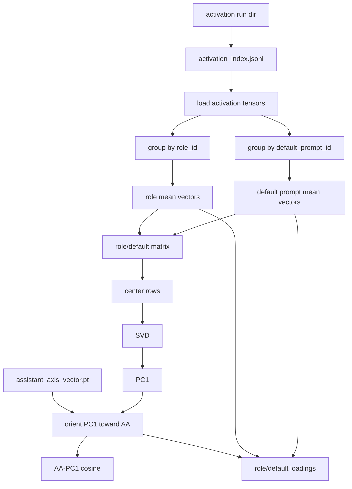

# Role Geometry Builder Design

This document defines the first geometry sanity-check stage after Assistant Axis construction.

## Purpose

The builder checks whether the Assistant Axis is related to the main role-geometry direction at a checkpoint.

It builds:

```text
role/default mean vectors
role matrix
PC1 over role/default means
AA-PC1 alignment
role loadings on AA and PC1
```

This is a final-checkpoint sanity check before checkpoint sweeps and attribution.

## Flow



## Inputs

Activation run:

```text
<activation-run-dir>/results/activation_index.jsonl
<activation-run-dir>/results/activations/*.pt
```

Assistant Axis run:

```text
<aa-run-dir>/results/assistant_axis_vector.pt
<aa-run-dir>/results/assistant_axis_summary.json
```

## Outputs

```text
results/
  role_vectors.jsonl
  role_vectors/*.pt
  role_geometry_summary.json
  role_pc1.pt
  role_loadings.csv
meta/
  run_manifest.json
  status.json
checkpoints/
  progress.json
logs/
  run.log
```

## Computation

Role/default means:

```text
mean_vector[group] = mean(activation vectors in group)
```

Groups:

```text
role:<role_id>
default_prompt:<default_prompt_id>
```

PC1:

```text
matrix = stack(mean_vector[group])
centered = matrix - mean(matrix, dim=0)
pc1 = first right singular vector of centered
```

Orientation:

```text
if cosine(pc1, assistant_axis) < 0:
    pc1 = -pc1
```

Loadings:

```text
pc1_loading[group] = dot(unit(mean_vector[group]), pc1)
aa_loading[group] = dot(unit(mean_vector[group]), assistant_axis)
```

## Validation Rules

The builder fails if:

- activation index is missing,
- activation rows mix multiple checkpoints/layers/pooling policies,
- selected activation tensor paths are missing,
- fewer than two mean-vector groups exist,
- mean-vector shapes disagree,
- Assistant Axis vector shape differs from mean-vector shape.

## Interpretation Boundary

Allowed after this builder:

> At this checkpoint, the Assistant Axis has cosine X with the leading role-geometry PC.

Not yet allowed:

> The Assistant Axis trajectory has stabilized.

That requires the checkpoint sweep.
