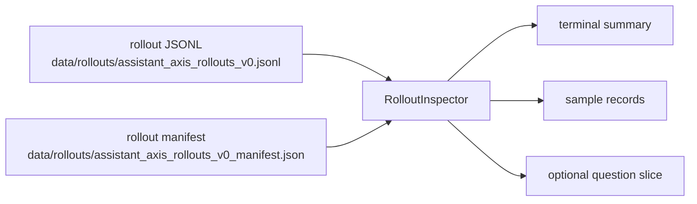
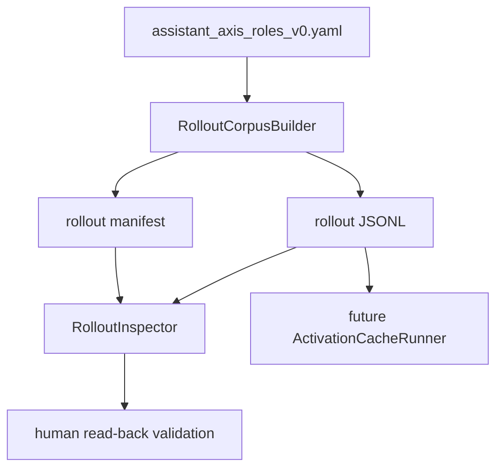
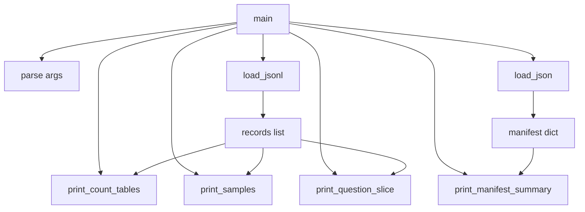

# Rollout Inspector Design

`RolloutInspector` is the first analyzer-style script in the repo. It does not build new experiment data. It reads the rollout corpus and manifest, then prints counts and representative records so we can understand what the builder produced.

## Why This Comes Before Activations

Before model execution, we need confidence that the fixed stimuli are coherent:

- the role/default split is correct,
- each role group has the expected count,
- default prompts are visible,
- placeholder role instructions are obvious,
- sample records are readable.

## Flow



## Builder vs Inspector



`RolloutCorpusBuilder` creates artifacts. `RolloutInspector` reads artifacts. `ActivationCacheRunner` will later consume artifacts for model execution.

## Script

```text
scripts/rollouts/inspect_rollouts.py
```

## Inputs

```text
data/rollouts/assistant_axis_rollouts_v0.jsonl
data/rollouts/assistant_axis_rollouts_v0_manifest.json
```

## Outputs

Terminal output only.

The inspector should be safe to run repeatedly because it does not mutate files.

## Helper Function Map



## What It Should Show

Counts:

- total records,
- record types,
- role groups,
- question categories,
- default prompt ids,
- role source statuses.

Samples:

- first role records,
- first default records,
- optional records for a chosen `question_id`,
- optional records for a chosen `role_group`.

## Learning Point

This script introduces a key research-engineering distinction:

```text
builder: creates an artifact
inspector/analyzer: reads an artifact and makes it understandable
runner: executes expensive/model work and needs progress state
```

`inspect_rollouts.py` is not a runner because it has no expensive external state and no resume cursor.
