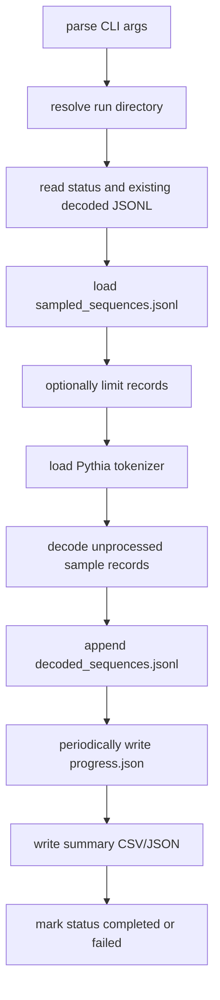

# Training Sequence Decoder Design

## Purpose

Phase C decodes sampled packed training sequences into human-readable previews:

```text
Phase B sampled token_ids -> Pythia tokenizer decode -> preview JSONL/CSV
```

This is an inspection gate before gradient attribution. It answers:

- Are the sampled rows real text-like Pythia packed sequences?
- Are token counts and batch/window metadata intact?
- Do we see expected packed-stream behavior such as EOD/EOS boundaries?
- Which examples are worth inspecting before we trust gradient scores?

It does not compute loss, gradients, attribution scores, or raw-document/source
mapping.

## Input From Phase B

The decoder consumes:

```text
results/sampled_sequences.jsonl
```

from `scripts/data/sample_training_sequences.py`.

Each record provides:

```text
sample_id
window_id
uid
batch_idx
source_file
token_ids
token_count
source
```

## Output

Canonical run directory:

```text
artifacts/runs/assistant_axis_attribution/
  pythia-410m-deduped/
    pile-deduped-pythia-preshuffled/
      assistant-axis-attribution-v0/
        training-sequence-decode/
          <run_id>/
            meta/run_manifest.json
            meta/status.json
            checkpoints/progress.json
            results/decoded_sequences.jsonl
            results/decoded_preview.csv
            results/decode_summary.json
            logs/run.log
```

Each decoded record contains the upstream ids, tokenizer metadata, EOD/EOS
counts, character counts, and start/middle/end previews. Full decoded text is
optional via `--include-full-text`.

## Main Spine



## Helper Functions

| Helper | Role |
| --- | --- |
| `load_jsonl` | Reads upstream samples or existing decoded records. |
| `append_jsonl` | Append-safe durable per-record output. |
| `normalize_token_ids` | Converts list-like token ids to plain integers. |
| `load_tokenizer` | Imports `transformers` only when not in dry-run mode. |
| `decode_token_ids` | Decodes with special tokens preserved and cleanup disabled. |
| `build_previews` | Produces start/middle/end text slices. |
| `existing_sample_ids` | Resume source of truth from decoded JSONL. |
| `write_progress` | Updates resume metadata and counts. |

## Decoding Rule

Use:

```python
tokenizer.decode(
    token_ids,
    skip_special_tokens=False,
    clean_up_tokenization_spaces=False,
)
```

Special tokens are preserved because the packed stream may contain document
boundaries. Cleanup is disabled because attribution inspection should not
silently rewrite tokenized text.

## Non-Goals

- No gradient scoring.
- No model forward/backward pass.
- No raw Pile document reconstruction.
- No source/category attribution.

Those belong to the next gradient-attribution stage.

## Local Dry Run

The tiny fixture exercises run-directory creation, manifest/status/progress
writing, and input validation without loading a tokenizer:

```bash
.venv/bin/python scripts/data/decode_training_sequences.py \
  --sample-jsonl data/training_windows/fixtures/sampled_sequences_tiny.jsonl \
  --dry-run \
  --run-id fixture-dry-run
```
