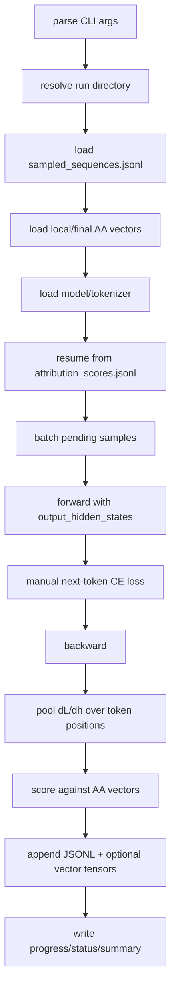

# Training Sequence Gradient Scorer Design

## Purpose

Phase 6A scores sampled packed Pythia training sequences by the local
activation-space pressure they exert along the Assistant Axis:

```text
packed token_ids -> next-token loss -> dL/dh_layer -> -cos(dL/dh_layer, v_AA)
```

This is the first Shifting-the-Gradient-style attribution stage.

## Inputs

The scorer consumes:

```text
sampled_sequences.jsonl
assistant_axis_vector.pt
optional final assistant_axis_vector.pt
optional additional named axis vectors
Pythia checkpoint revision
```

The sampled sequence JSONL comes from:

```text
scripts/data/sample_training_sequences.py
```

The axis vector comes from:

```text
scripts/analysis/build_assistant_axis.py
```

## Core Logic

Each Pythia packed row has 2049 token ids. For scoring, use:

```text
input_ids = token_ids[:-1]
targets   = token_ids[1:]
```

This gives 2048 next-token prediction positions and avoids exceeding the
2048-token model context.

For each batch:

1. Load token ids and pad to the batch max length.
2. Forward through Pythia with `output_hidden_states=True`.
3. Select `hidden_states[layer + 1]`, matching the activation cache runner.
4. Retain the hidden-state gradient.
5. Compute unreduced next-token cross entropy manually.
6. Backprop the masked mean loss.
7. Read `dL/dh_layer`.
8. Pool the gradient over all valid training-token positions.
9. Define update pressure:

```text
u_i = -mean_tokens(dL_i/dh_layer)
```

10. Compute:

```text
local_aa_score = cosine(u_i, v_AA_local)
final_aa_score = cosine(u_i, v_AA_final)
```

The scorer also supports repeated `--axis-target NAME=PATH` arguments. Every target is written under `axis_scores`, avoiding ambiguous labels when an endpoint axis is used with a pre-window model checkpoint.

For each named target it additionally computes token-level cosines before pooling and stores count, mean, standard deviation, quantiles, extrema, and positive fraction. `--save-token-axis-scores` persists the complete token arrays for later cancellation analysis.

## Interpretation

```text
positive high: sequence locally pushes toward the Assistant Axis
near zero: little AA-aligned pressure
negative: sequence locally pushes away from the Assistant Axis
```

This is an activation-space first-order diagnostic, not a claim that a sequence
caused a particular final weight update.

## Token Scope

This is not response-token pooling.

For fixed rollout activations, `response_token_mean` was necessary because we
wanted to avoid measuring role-instruction/prompt tokens. For Pythia packed
training data, there is no prompt/response boundary. The model is trained on
every next-token target in the packed sequence.

So Phase 6A pools over:

```text
all valid input positions in token_ids[:-1]
```

The corresponding targets are:

```text
token_ids[1:]
```

This is the principled training-data object. Later raw-document mapping could
split packed sequences into document spans, but the first attribution unit is
the packed training sequence as Pythia saw it.

## Output

Canonical run directory:

```text
artifacts/runs/assistant_axis_attribution/
  pythia-410m-deduped/
    pile-deduped-pythia-preshuffled/
      assistant-axis-attribution-v0/
        gradient-attribution-layer12/
          <run_id>/
            meta/run_manifest.json
            meta/status.json
            checkpoints/progress.json
            results/attribution_scores.jsonl
            results/attribution_scores.csv
            results/attribution_summary.json
            results/gradient_pressure_vectors/*.pt  # optional
            results/gradient_pressure_vectors/*token_axis_scores.pt  # optional
            logs/run.log
```

## Main Spine



## Helper Functions

| Helper | Role |
| --- | --- |
| `load_jsonl` | Read sampled rows and previous score rows. |
| `load_axis_vector` | Load and normalize an AA vector from a run directory or tensor path. |
| `prepare_batch` | Convert 2049-token rows into padded 2048-token inputs/targets. |
| `score_batch` | Forward/backward one batch and return per-sequence scores. |
| `safe_cosine` | Compute finite cosine similarity with validation. |
| `load_completed_ids` | Resume from durable score JSONL and optional vector files. |
| `write_progress` | Persist selected/completed ids and cursor. |
| `summarize_scores` | Aggregate counts and window-level score summaries. |

## Non-Goals

- No raw document/source mapping.
- No PCA/SVD analysis; that is Phase 6B.
- No causal gradient manipulation; that is Phase 7.
- No continued training.
