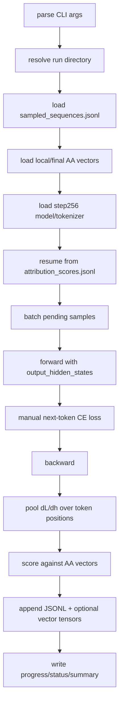

# Training Sequence Gradient Scorer Design

> Current primary score: raw activation-gradient dot. Cosine is retained as an
> orientation diagnostic for compatibility with the earlier smoke experiments.

## Purpose

Phase 6A scores sampled packed Pythia training sequences by the local
activation-space pressure they exert along the Assistant Axis:

```text
packed token_ids -> next-token loss -> dL/dh_layer
                 -> dot(-mean(dL/dh_layer), v_target)
```

This is the first Shifting-the-Gradient-style attribution stage.

## Inputs

The scorer consumes:

```text
sampled_sequences.jsonl
concept_target_bundle.json
or explicit local/final/additional axis vectors
Pythia checkpoint revision
```

The sampled sequence JSONL comes from:

```text
scripts/data/sample_training_sequences.py
```

The axis vector comes from:

```text
scripts/analysis/build_assistant_axis.py
```

## Core Logic

Each Pythia packed row has 2049 token ids. For scoring, use:

```text
input_ids = token_ids[:-1]
targets   = token_ids[1:]
```

This gives 2048 next-token prediction positions and avoids exceeding the
2048-token model context.

For each batch:

1. Load token ids and pad to the batch max length.
2. Forward through Pythia with `output_hidden_states=True`.
3. Select `hidden_states[layer + 1]`, matching the activation cache runner.
4. Retain the hidden-state gradient.
5. Compute unreduced next-token cross entropy manually.
6. Compute one mean next-token loss per sequence, sum those independent means,
   and backpropagate the sum.
7. Read `dL/dh_layer`.
8. Pool the gradient over all valid training-token positions.
9. Define update pressure:

```text
u_i = -mean_tokens(dL_i/dh_layer)
```

10. Compute the primary and diagnostic scores:

```text
primary:   dot(u_i, v_target)
diagnostic: cosine(u_i, v_target)
```

With `--target-bundle`, the runner reads endpoint, final, and innovation targets
directly from the concept-attribution config. It also supports the older
explicit axis arguments.

For each target it computes token-level dots and cosines before pooling and
stores count, mean, standard deviation, quantiles, extrema, and positive
fraction. `--save-token-axis-scores` persists both complete arrays.

The batch loss is:

```text
L_batch = sum_i mean_valid_tokens(L_i)
```

It is not a mean across all tokens in the batch. Therefore adding unrelated
records to a batch does not divide or rescale a sequence's hidden gradient.

## Interpretation

```text
positive dot: sequence locally pushes toward the target
near zero: little AA-aligned pressure
negative dot: sequence locally pushes away from the target
```

Dot preserves update-pressure magnitude. Cosine discards magnitude and only
describes orientation, so it remains useful but is not the ranking score.

This is an activation-space first-order diagnostic, not a claim that a sequence
caused a particular final weight update.

## Token Scope

This is not response-token pooling.

For fixed rollout activations, `response_token_mean` was necessary because we
wanted to avoid measuring role-instruction/prompt tokens. For Pythia packed
training data, there is no prompt/response boundary. The model is trained on
every next-token target in the packed sequence.

So Phase 6A pools over:

```text
all valid input positions in token_ids[:-1]
```

The corresponding targets are:

```text
token_ids[1:]
```

This is the principled training-data object. Later raw-document mapping could
split packed sequences into document spans, but the first attribution unit is
the packed training sequence as Pythia saw it.

## Output

Canonical run directory:

```text
artifacts/runs/assistant_axis_attribution/
  pythia-410m-deduped/
    pile-deduped-pythia-preshuffled/
      assistant-axis-attribution-v0/
        gradient-attribution-layer12/
          <run_id>/
            meta/run_manifest.json
            meta/status.json
            checkpoints/progress.json
            results/attribution_scores.jsonl
            results/attribution_scores.csv
            results/attribution_summary.json
            results/gradient_pressure_vectors/*.pt  # optional
            results/gradient_pressure_vectors/*token_axis_scores.pt  # optional
            logs/run.log
```

## Main Spine



## Helper Functions

| Helper | Role |
| --- | --- |
| `load_jsonl` | Read sampled rows and previous score rows. |
| `load_axis_vector` | Load and normalize an AA vector from a run directory or tensor path. |
| `prepare_batch` | Convert 2049-token rows into padded 2048-token inputs/targets. |
| `score_batch` | Forward/backward one batch and return per-sequence scores. |
| `safe_dot`, `safe_cosine` | Compute finite primary dot and diagnostic cosine scores. |
| `token_dot_diagnostics` | Summarize token-level update-pressure dots. |
| `load_completed_ids` | Resume from durable score JSONL and optional vector files. |
| `write_progress` | Persist selected/completed ids and cursor. |
| `summarize_scores` | Aggregate counts and window-level score summaries. |

## Non-Goals

- No raw document/source mapping.
- No PCA/SVD analysis; that is Phase 6B.
- No causal gradient manipulation; that is Phase 7.
- No continued training.

## Concept-Attribution Execution

Smoke test:

```bash
python scripts/analysis/score_training_sequence_gradients.py \
  --sample-jsonl <subset-run>/results/activation_gradient_sequences.jsonl \
  --target-bundle <target-run>/results/concept_target_bundle.json \
  --limit 20 \
  --batch-size 1 \
  --hf-cache-dir /workspace/hf_cache \
  --save-gradient-vectors \
  --run-id activation-dot-step256-smoke-b1-v0
```

Repeat the same records with `--batch-size 8`, then compare dots:

```bash
python scripts/analysis/compare_gradient_attribution_runs.py \
  --reference-run-dir <batch1-run> \
  --candidate-run-dir <batch8-run> \
  --score-type dot \
  --max-absolute-delta 0.000001 \
  --run-id activation-dot-batch-invariance-v0
```
