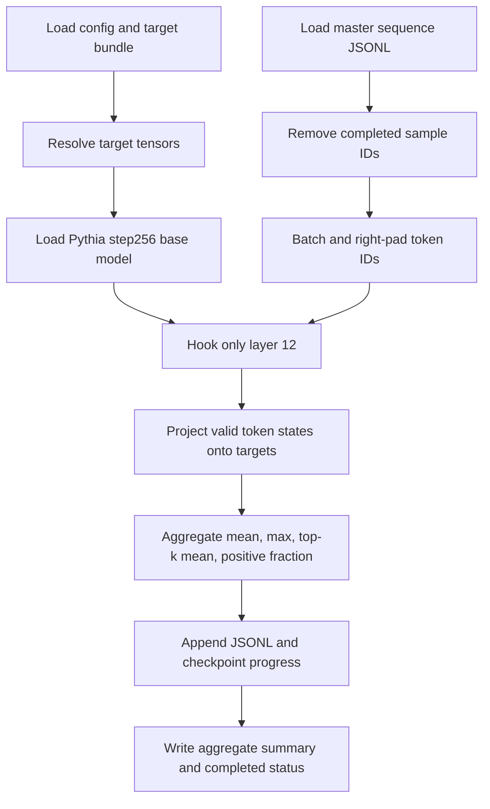

# Vector Filter Runner Design

## Purpose

Vector Filter is the cheapest method in the concept-attribution ladder. It asks:

> Does a packed training sequence strongly express the endpoint, final, or
> innovation direction in its `step256` layer-12 hidden states?

It is a forward-only representational filter. It does not measure the
sequence's training gradient and is not causal attribution.

## Inputs

```text
master_sequences.jsonl
  5,000 packed sequences from step256 -> step512

concept_target_bundle.json
  endpoint_step512
  final_step143000
  innovation_256_to_512
  step256 probe midpoint

experiment config
  model, checkpoint, layer, batch size, token scope, top-k
```

## Main Spine



The model receives `token_ids[:-1]`, matching positions that predict the next
tokens. Padding and the final unscored packed token are excluded.

## Primary and Centered Scores

For token hidden state `h_t` and target `v`:

```text
raw_projection_t = h_t dot v
```

Raw mean projection is primary. The centered sensitivity score uses one fixed
reference for every sequence:

```text
reference = midpoint(step256 construction default mean,
                     step256 construction contrast mean)

centered_projection_t = (h_t - reference) dot v
```

We do not center each sequence by its own mean because that would erase the
sequence-level mean signal we are trying to rank.

## Important Helpers

| Helper | Role |
| --- | --- |
| `portable_artifact_path` | Resolves target tensors locally or after an HF artifact tree is relocated. |
| `prepare_batch` | Converts packed records to padded `token_ids[:-1]` tensors and valid lengths. |
| `score_batch` | Hooks layer 12, computes token projections, and emits one record per sequence. |
| `projection_summary` | Computes mean, max, top-k mean, and positive-token fraction. |
| `summarize` | Aggregates record-level distributions without mutating raw scores. |

## Why `AutoModel`

The runner loads the Pythia base transformer without the language-model head.
Vector Filter needs hidden states but not vocabulary logits. This avoids a large
`batch x sequence x vocabulary` tensor and makes batches such as 20 practical.

## Outputs

```text
results/vector_filter_scores.jsonl
results/vector_filter_summary.json
results/results.json
meta/run_manifest.json
meta/status.json
checkpoints/progress.json
logs/run.log
```

Every score record preserves `sample_id`, `uid`, `batch_idx`, source Parquet
file, checkpoint, layer, valid-token count, raw scores, centered scores, and
hidden-state norm.

## Execution

Start with a short smoke:

```bash
python scripts/analysis/score_vector_filter.py \
  --sample-jsonl <subset-run>/results/master_sequences.jsonl \
  --target-bundle <target-run>/results/concept_target_bundle.json \
  --limit 50 \
  --batch-size 10 \
  --hf-cache-dir /workspace/hf_cache \
  --run-id vector-filter-step256-smoke-v0
```

Then run all 5,000 with a new run id:

```bash
python scripts/analysis/score_vector_filter.py \
  --sample-jsonl <subset-run>/results/master_sequences.jsonl \
  --target-bundle <target-run>/results/concept_target_bundle.json \
  --batch-size 20 \
  --save-every 100 \
  --hf-cache-dir /workspace/hf_cache \
  --run-id vector-filter-step256-5000-v0
```

If memory is insufficient, reduce only `--batch-size`. Do not change the target
bundle or sample JSONL between smoke and full runs.
