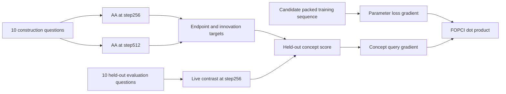

# Concept Target Split Walkthrough

## Two Different Axes of Splitting

There are two unrelated uses of the word "between" in this experiment.

### Checkpoint Window

```text
step256 ---------------- training sequences ----------------> step512
```

These are two versions of Pythia's parameters. The packed sequences whose
`batch_idx` lies from 256 through 511 are the candidate training data.

### Question Split

```text
20 rollout questions
  -> 10 construction questions
  -> 10 evaluation questions
```

These are semantic measurement prompts. They are not Pythia training data and
they are not checkpoints.

## What Construction Means

At each checkpoint, the construction questions produce default-assistant and
contrast-role activations:

```text
AA_256 = mean(default construction activations at step256)
       - mean(contrast construction activations at step256)

AA_512 = mean(default construction activations at step512)
       - mean(contrast construction activations at step512)
```

The endpoint target is `AA_512`. The innovation target is the part of `AA_512`
that is orthogonal to `AA_256`:

```text
innovation = normalize(AA_512 - projection_of_AA_512_onto_AA_256)
```

This is not `step512 minus step256` model weights. It is a direction derived
from how the two checkpoint models represent the same construction prompts.

## What Evaluation Means

The other 10 questions define a live Assistant Axis contrast at `step256`:

```text
Delta_eval(theta256)
  = mean(default evaluation activations)
  - mean(contrast evaluation activations)
```

For a fixed target `v`, FOPCI asks whether one candidate training sequence's
parameter update would increase:

```text
S_target(theta256) = v dot Delta_eval(theta256)
```

The target `v` came from construction questions. The live score comes from
evaluation questions.

## Where Circularity Would Enter

Suppose question `q000` has an unusual wording feature. If `q000` helps define
the target and also appears in the live FOPCI score, a sequence matching that
wording may rank highly because it affects `q000`, not because it generally
affects Assistant Axis geometry.

```text
same questions define target
        +
same questions evaluate influence
        =
prompt-specific self-confirmation risk
```

The held-out split changes this to:

```text
construction questions define target
different evaluation questions test influence
```

This does not remove every source of circularity. Both halves still share the
same roles, default prompts, fixed responses, and broad domains. It does remove
the most direct prompt-level reuse.

## Why Targeting Step512 Is Not Itself Circular

Using `AA_512` as a target intentionally uses future-checkpoint information.
That is retrospective attribution:

```text
Given the direction observed at step512,
which step256-window sequences had first-order influence toward it?
```

This would be circular only if we then claimed that the experiment discovered
the target without looking at step512. We do not. We explicitly condition on
the observed endpoint direction.

## Remaining Claim Boundary

Even with held-out questions, FOPCI remains a local first-order estimate at
`step256`. A causal formation claim still needs controlled updates on selected
training sequences followed by held-out geometry and behavioral measurement.


