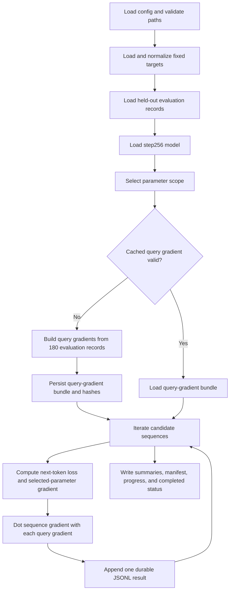

# FOPCI From First Principles

## What This Guide Is For

This guide explains First-Order Parameter Concept Influence (FOPCI) in the
specific Assistant Axis experiment in this repository. It starts from the
question we want to answer, constructs every mathematical object, follows the
objects through the implementation, and then explains which optimizations are
mathematically safe.

The intended outcome is that you can answer all of these without memorizing a
formula:

1. What exactly is the candidate cause?
2. What exactly is the measured concept?
3. Why are two gradients needed?
4. Why is there a minus sign?
5. What does a positive or negative score mean?
6. What does FOPCI establish, and what does it not establish?
7. Which parts of the current implementation are expensive?
8. How can they be batched without changing the quantity being measured?

## The Research Question

We observe an Assistant Axis direction at later Pythia checkpoints. We want to
ask a retrospective question:

> At `step256`, which packed training sequences would have pushed the model's
> parameters in a direction that locally increases a held-out measurement of
> the later Assistant Axis?

This wording matters.

- The scoring model is the model at `step256`.
- The candidate sequences come from the `step256 -> step512` training window.
- The target direction is derived retrospectively from `step512` or
  `step143000`.
- The measured effect is a local, first-order effect at `step256`.
- The sequence unit is one packed 2049-token training sequence, not one clean
  source document.

FOPCI does not replay Pythia training. It asks what one infinitesimal
gradient-descent update would do to a chosen concept score.

## Object Ledger

| Symbol | Repository object | Meaning |
| --- | --- | --- |
| `theta` | `pythia-410m-deduped@step256` parameters | Current model state where influence is evaluated |
| `x_i` | One row in `sampled_sequences.jsonl` | Candidate packed training sequence |
| `L_i(theta)` | Next-token loss on `x_i` | Training objective supplied by sequence `i` |
| `v_t` | Fixed vector in `concept_target_bundle.json` | Representation-space direction defining target concept `t` |
| `E_default` | Held-out default-assistant evaluation records | Positive side of the live concept contrast |
| `E_contrast` | Held-out role evaluation records | Contrast side of the live concept contrast |
| `Delta_eval(theta)` | Mean default activation minus mean contrast activation | Live held-out Assistant Axis contrast at `theta` |
| `S_t(theta)` | `v_t dot Delta_eval(theta)` | Scalar live concept score for target `t` |
| `q_t` | `grad_theta S_t(theta)` | Query gradient: parameter direction that increases the concept score |
| `g_i` | `grad_theta L_i(theta)` | Sequence loss gradient |
| `-g_i` | First-order SGD update direction, ignoring optimizer details | Direction sequence `i` pushes parameters under gradient descent |
| `I_i,t` | `-g_i dot q_t` | FOPCI score for sequence `i` and target `t` |

There are three primary targets in the current experiment:

- `endpoint_step512`
- `final_step143000`
- `innovation_256_to_512`

Each target has its own `v_t`, `q_t`, and FOPCI score.

## Step 1: A Training Sequence Produces an Update Direction

For one packed sequence `x_i`, the language model loss is:

```text
L_i(theta) = mean next-token cross-entropy on x_i
```

Its parameter gradient is:

```text
g_i = grad_theta L_i(theta)
```

Gradient descent moves opposite the loss gradient:

```text
theta_after = theta - eta * g_i
```

where `eta` is a small positive learning rate. Therefore `g_i` is not the
update direction; `-g_i` is the update direction.

This is the source of the minus sign in FOPCI.

## Step 2: Define What Change Counts as More Assistant-Like

FOPCI needs a scalar question whose answer can change when parameters change.
The fixed target vector alone is not enough. A vector does not depend on the
live model parameters, so its parameter gradient is zero.

First, construct a live held-out representation contrast:

```text
Delta_eval(theta)
  = mean layer-12 response activation on default evaluation records
  - mean layer-12 response activation on contrast-role evaluation records
```

Then project this live contrast onto fixed target `v_t`:

```text
S_t(theta) = v_t dot Delta_eval(theta)
```

`v_t` is fixed and detached. `Delta_eval(theta)` is recomputed through the live
`step256` model and remains differentiable.

Interpretation:

- Larger `S_t` means the live evaluation contrast aligns more strongly with
  target `t`.
- Smaller `S_t` means weaker or oppositely directed alignment.

## Why Construction and Evaluation Questions Are Split

The target vector is built using ten construction questions. The live concept
score uses ten different evaluation questions.

```text
construction questions -> fixed target v_t
evaluation questions   -> live contrast Delta_eval(theta)
```

If the same questions defined both sides, a sequence could score highly by
affecting prompt-specific quirks rather than a general Assistant Axis. The
held-out split removes the most direct form of this self-confirmation.

It does not remove every possible shared feature: both halves still use the
same broad role framework, model, and response corpus.

## Step 3: Translate the Concept Question Into Parameter Space

Differentiate the scalar concept score with respect to model parameters:

```text
q_t = grad_theta S_t(theta)
```

`q_t` is the query gradient.

It answers:

> Which infinitesimal parameter changes would most increase this held-out
> target-alignment score?

Both `g_i` and `q_t` now live in the same parameter space and have one component
per selected parameter. That makes their dot product meaningful.

## Step 4: Derive FOPCI

Apply one small gradient-descent update from sequence `i`:

```text
delta_theta_i = -eta * g_i
```

Use a first-order Taylor expansion of the concept score:

```text
S_t(theta + delta_theta_i)
  approximately S_t(theta) + q_t dot delta_theta_i
```

Substitute the update:

```text
Delta S_i,t approximately -eta * q_t dot g_i
```

Because `eta` is positive and common to all ranked sequences, the implemented
score omits it:

```text
FOPCI_i,t = -g_i dot q_t
```

### Sign Interpretation

- Positive: the sequence's gradient-descent update locally increases the
  held-out concept score.
- Negative: the update locally decreases the concept score.
- Near zero: the update is locally orthogonal to the concept query, or has very
  small magnitude.

### Magnitude Interpretation

The raw dot combines two factors:

1. how large the sequence gradient is;
2. how aligned it is with the query gradient.

The diagnostic cosine separates alignment from magnitude:

```text
cosine_i,t = FOPCI_i,t / (norm(g_i) * norm(q_t))
```

Raw dot is primary because actual first-order change depends on magnitude.
Cosine helps diagnose whether a large raw score came from alignment or merely
from an unusually large gradient.

## A Two-Parameter Toy Example

Suppose the selected parameter space has only two coordinates.

```text
q = [2, 1]
```

Increasing either parameter increases the concept score, but the first
parameter matters twice as much locally.

Sequence A has loss gradient:

```text
g_A = [-3, -1]
update direction -g_A = [3, 1]
FOPCI_A = -g_A dot q = 7
```

Sequence A is strongly concept-amplifying.

Sequence B has:

```text
g_B = [1, 2]
update direction -g_B = [-1, -2]
FOPCI_B = -g_B dot q = -4
```

Sequence B is concept-suppressing.

Sequence C has:

```text
g_C = [1, -2]
FOPCI_C = -g_C dot q = 0
```

Sequence C changes parameters, but its first-order effect is orthogonal to this
specific concept query.

## Why FOPCI Is Different From the Other Two Methods

### Vector Filter

```text
hidden state dot target vector
```

Question answered:

> Does the sequence already express this direction in its layer-12
> representations?

It is forward-only and cheap. Expression is not update influence.

### Activation-Gradient Attribution

```text
-grad_hidden L_i dot target vector
```

Question answered:

> Does the sequence loss exert local update pressure along this direction at
> the chosen activation site?

It works in layer-12 activation space, not full parameter space.

### FOPCI

```text
-grad_parameters L_i dot grad_parameters S_t
```

Question answered:

> Does the sequence's parameter update locally increase a held-out live
> concept score?

FOPCI connects the training loss and the held-out concept through shared
parameters. It is closer to an influence calculation, but remains local and
first-order.

## Current Repository Implementation

The runner is:

```text
scripts/analysis/score_first_order_concept_influence.py
```

### Input Artifacts

1. `sampled_sequences.jsonl`
   - packed token IDs;
   - stable `sample_id`;
   - `batch_idx` and window identity.
2. `concept_target_bundle.json`
   - target vectors;
   - construction/evaluation question IDs;
   - evaluation-record path and hashes.
3. Experiment config
   - checkpoint, layer, target names, and parameter-scope policy.
4. `pythia-410m-deduped@step256`
   - live model used for both sequence loss and concept query.

### Execution Spine



### Parameter Scope

The pilot used `layer12_only`:

```text
12 parameter tensors
12,596,224 scalar parameters
```

The scope includes layer-12 attention, MLP, and layer-normalization parameters.
The scope name, exact parameter names, count, and hash are persisted.

Changing parameter scope changes the question. Scores from `layer12_only` and
`all_parameters` should not be pooled as though they are interchangeable.

### Query-Gradient Construction

The current code processes 180 held-out records sequentially:

```text
20 default records, weight +1/20 each
160 contrast records, weight -1/160 each
```

For every record it:

1. runs the prompt and fixed response through the live model;
2. mean-pools layer-12 response-token activations;
3. projects onto all three fixed targets;
4. takes one selected-parameter gradient per target;
5. accumulates the weighted gradient on CPU.

The result is one query gradient per target. The bundle is saved once and
validated by parameter names and scope hash before reuse.

### Sequence Scoring

For every packed sequence the current code:

1. computes mean next-token loss over at most 2048 targets;
2. differentiates loss with respect to the selected parameters;
3. computes gradient norm;
4. dots that gradient with each cached query gradient;
5. writes one result immediately to `fopci_scores.jsonl`;
6. records progress so interrupted runs can skip completed sample IDs.

Per-sequence parameter gradients are not persisted. Only scores, norms, loss,
scope metadata, and provenance are persisted.

## Reading One Output Record

Important fields in `fopci_scores.jsonl`:

| Field | Meaning |
| --- | --- |
| `sample_id` | Stable packed-sequence identity |
| `loss` | Mean next-token loss at `step256` |
| `sequence_gradient_norm` | `norm(g_i)` over selected parameters |
| `axis_scores.<target>.query_gradient_norm` | `norm(q_t)` |
| `axis_scores.<target>.negative_gradient_dot` | Primary FOPCI score |
| `axis_scores.<target>.gradient_cosine` | Magnitude-normalized alignment diagnostic |
| `parameter_scope_id` | Which parameters were included |
| `parameter_count` | Number of included scalar parameters |
| `curvature` | Currently `identity` |

## What Identity Curvature Means

Classical influence functions often include an inverse Hessian:

```text
-grad L_i dot H_inverse dot grad S_t
```

The current method uses:

```text
H_inverse approximately Identity
```

Therefore it measures direct first-order gradient alignment, not curvature-
corrected influence. It also omits the historical optimizer state, momentum,
weight decay, clipping, and interactions with neighboring training examples.

This is why the method is named first-order parameter concept influence rather
than exact training influence.

## What the Ten-Sequence Pilot Established

The pilot established numerical and engineering validity:

- all three methods completed on the same ten sample IDs;
- batch-1 and batch-2 activation-gradient dots agreed to at most about
  `5e-12`, below the `1e-6` gate;
- query-gradient norms were finite and approximately `5.35`;
- sequence-gradient norms were finite and positive;
- target-bundle and evaluation-record hashes matched;
- FOPCI produced both positive and negative scores.

It did not establish stable cross-method correlation or a causal population
claim. Ten records are intentionally too few for that.

## Where Runtime Went

Measured on the RTX 4090 pilot:

```text
query-gradient construction over 180 records: about 168 seconds
FOPCI scoring of ten packed sequences:        about 1.2 seconds
```

The current bottleneck is query construction, not sequence scoring. Reusing the
cached query gradient is therefore the highest-value optimization for the
50-record smoke.

## Optimization 1: Resume Cached Work

Already implemented:

- query-gradient bundle reuse;
- parameter-name and scope-hash validation;
- durable per-sequence JSONL writes;
- completed-sample detection;
- progress/status artifacts.

For a 50-record continuation, preserve the ten-record run, clone it to a new
50-record run directory, and process only the remaining 40 sample IDs. This
avoids rebuilding the query and preserves the original pilot as immutable
evidence.

## Optimization 2: Batch Query-Gradient Construction

Implemented behind `--query-batch-size`. The sequential setting remains
`--query-batch-size 1` and is the numerical reference.

The current query is a gradient of a weighted sum:

```text
S_t(theta)
  = (1 / N_default) * sum default projections
  - (1 / N_contrast) * sum contrast projections
```

Gradient linearity gives:

```text
grad S_t
  = (1 / N_default) * sum grad(default projection)
  - (1 / N_contrast) * sum grad(contrast projection)
```

Therefore several records can be padded into a batch, their response-token
spans pooled independently, and their weighted projections summed before one
backward operation per target.

This is exact apart from ordinary floating-point reduction-order differences.
It does not change the estimand.

### Required Validation

For every target compare sequential and batched query gradients using:

- maximum absolute component delta;
- relative L2 error;
- cosine similarity;
- norm ratio;
- downstream FOPCI score deltas on the fixed ten-sequence reference set.

Do not accept batching merely because aggregate norms look similar.

## Optimization 3: Batch Per-Sequence FOPCI Correctly

### The Incorrect Shortcut

This is not sufficient:

```text
loss = sum per-sequence losses
grad = grad_theta(loss)
```

It returns the sum of sequence gradients. Individual FOPCI scores are lost.

### Exact Option A: Batched Vector-Jacobian Products

Compute a vector of per-sequence losses and use batched autograd bases to obtain
one gradient per sequence. This is conceptually direct but materializes a
`batch_size x parameter_count` gradient object, which can be memory-heavy.

### Exact Option B: Directional Derivatives

FOPCI only needs:

```text
grad_theta L_i dot q_t
```

It does not need the full `grad_theta L_i` tensor. Define a scalar perturbation
`epsilon` along query direction `q_t`:

```text
theta(epsilon) = theta + epsilon * q_t
```

Then:

```text
d L_i(theta(epsilon)) / d epsilon at epsilon=0
  = grad_theta L_i dot q_t
```

A functional model call plus `torch.func.jvp`/`jacfwd` can calculate this
directional derivative for a batch of per-sequence losses without storing all
per-sequence parameter gradients.

One directional pass is needed per target unless target directions are further
vectorized.

This option is implemented as:

```text
--sequence-score-mode directional_jvp
--sequence-batch-size <N>
```

The sequential reference remains:

```text
--sequence-score-mode sequential_gradient
--sequence-batch-size 1
```

### Tradeoff

- Batched VJPs are easier to compare to the current implementation but use more
  memory.
- Directional derivatives target exactly the required scalar and can scale
  better, but require more invasive functional-model code and operator-support
  testing.

For 50 cached-query sequences, implementation risk is larger than the runtime
saved. For hundreds or thousands of sequences, directional derivatives become
high value.

The repository now includes `compare_fopci_runs.py`, which compares optimized
raw dots with a sequential run using combined absolute and relative tolerances.
Optimized modes are not considered validated on Pythia merely because the CPU
toy-model equivalence tests pass; the fixed ten-sequence GPU reference remains
the acceptance gate.

## Optimization 4: Reuse One Loaded Model

The current orchestration launches separate processes for Vector Filter,
activation-gradient scoring, batch validation, and FOPCI. Each process reloads
the model.

A shared in-process orchestrator could load one model and execute compatible
stages sequentially. This saves fixed startup time but increases coupling and
the risk of stale hooks, retained graphs, or gradients contaminating later
stages.

If implemented, stage boundaries must explicitly:

- remove hooks;
- clear gradients with `set_to_none=True`;
- free stage-specific tensors;
- verify model mode and dtype;
- record independent stage manifests.

## Optimization Priorities by Scale

### 50 Sequences

1. Reuse cached query gradient.
2. Resume the first ten sequence scores.
3. Keep sequential FOPCI scoring.
4. Use validated batching for Vector Filter and activation gradient.

### 500 Sequences

1. Batch query construction.
2. Reuse cached query across all subsets.
3. Benchmark directional-derivative FOPCI against sequential reference.
4. Consider shared model loading.

### 5,000+ Sequences

1. Directional-derivative FOPCI or another per-example gradient method becomes
   important.
2. Separate screening and expensive scoring into stable nested subsets.
3. Keep frequent durable checkpoints.
4. Benchmark throughput, peak memory, and numerical agreement before the full
   matrix.

## Scientific Claim Boundary

A high positive FOPCI score supports this statement:

> At `step256`, under the selected parameter scope and identity-curvature
> approximation, a small gradient-descent update on this packed sequence is
> predicted to increase the held-out target-alignment score to first order.

It does not by itself support:

> This document caused the Assistant Axis to form during historical training.

That stronger claim would require controlled intervention:

1. select high-positive, high-negative, and matched-control sequences;
2. apply controlled updates from the same starting checkpoint;
3. measure held-out geometry and behavior after updating;
4. compare against random and loss-matched controls;
5. test persistence across steps, layers, targets, and seeds.

## Failure Modes to Check

- Construction and evaluation questions overlap.
- Target vector accidentally remains in autograd.
- Query bundle is reused with a different parameter scope.
- Sequence loss uses inconsistent token normalization.
- Batched losses change per-sequence scaling.
- Scores are compared across different parameter scopes.
- A few high-gradient-norm outliers dominate raw dots.
- Packed sequences are described as clean source documents.
- Identity-curvature scores are described as exact historical influence.
- Adaptive sample correlations are reported as though they came from a random
  population sample.

## Active-Recall Checks

Try answering before revealing the answer below each question.

### 1. Why is the target vector not itself the query gradient?

Because the target vector lives in layer-12 representation space and is fixed.
The query gradient is the derivative of a live scalar concept score with
respect to selected model parameters.

### 2. Why is FOPCI negative gradient dot query gradient?

Training uses gradient descent, whose update direction is `-grad L`, not
`grad L`.

### 3. What does a large positive raw dot combine?

Strong alignment with the query, large sequence-gradient magnitude, or both.

### 4. Why can query records be batched exactly?

The query score is a weighted sum and differentiation is linear. Correctly
weighted batched sums have the same gradient up to floating-point reduction
order.

### 5. Why can we not simply sum sequence losses for batched FOPCI?

That produces one aggregate gradient and destroys individual sequence scores.

### 6. Why is directional differentiation attractive?

FOPCI needs only `grad L_i dot q`, which is exactly the directional derivative
of each loss along `q`; full per-sequence parameter gradients need not be
materialized.

### 7. What did the ten-sequence pilot establish?

Pipeline completion, finite nonzero gradients, hash consistency, and numerical
batch invariance. It did not establish stable correlations or causality.

## Minimal Mental Model

If everything else is forgotten, retain this chain:

```text
later Assistant Axis target
    -> held-out live concept score at step256
    -> query gradient q: how parameters could increase that score

candidate packed sequence
    -> training loss
    -> sequence gradient g: how its loss wants parameters to move

compare the actual descent direction -g with q
    -> FOPCI = -g dot q
```

That is the whole method. The remaining machinery exists to make each object
held out, numerically valid, resumable, and scientifically interpretable.
