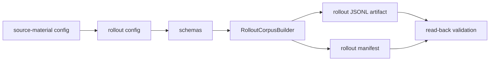
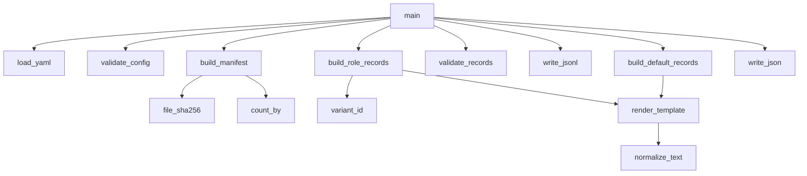

# Rollout Corpus Walkthrough

This note explains the first completed vertical slice in research-engineering terms.

The slice is:



## Important Naming Clarification

`data/rollouts/assistant_axis_rollouts_v0.jsonl` does not contain model-generated responses yet.

Here, "rollout" means:

> a fixed text stimulus record that will later be fed through models/checkpoints.

It currently contains prompts/questions, not generated answers. A later stage can add fixed response text generated once by a strong model, or can treat the prompt text as the initial stimulus for activation debugging.

## Files In This Slice

### Source-Material Config

```text
configs/rollouts/assistant_axis_source_material_v0.yaml
```

Question it answers:

> What are we borrowing from the old trait-geometry repo, and what must change?

It records:

- old repo path,
- old config paths,
- old file hashes,
- Assistant Axis source URLs,
- old 8640-record trait-grid shape,
- new 1040-record Pythia rollout target,
- the imported 40-question candidate pool,
- what we should not reuse directly.

This is provenance. It is not the final experiment input.

### Rollout Config

```text
configs/rollouts/assistant_axis_roles_v0.yaml
```

Question it answers:

> What fixed stimuli do we actually want to build for this project?

It defines:

- 48 target roles,
- 3 role groups with 16 roles each,
- 20 selected questions,
- 4 default prompt families,
- the prompt templates,
- expected output counts,
- warnings about placeholder role instructions.

This is the main input to `RolloutCorpusBuilder`.

### Rollout Record Schema

```text
configs/schemas/rollout_record.schema.yaml
```

Question it answers:

> What fields must one JSONL record contain?

A role record has fields like:

- `rollout_id`
- `record_type: role`
- `role_id`
- `role_group`
- `role_instruction`
- `question_id`
- `question_category`
- `prompt_text`
- `source`

A default record has:

- `rollout_id`
- `record_type: default`
- `default_prompt_id`
- `default_prompt`
- `question_id`
- `prompt_text`
- `source`

The schema explicitly forbids old trait-grid fields like `trait_axis_id`, `condition`, and `polarity` for this initial corpus.

### Rollout Manifest Schema

```text
configs/schemas/rollout_manifest.schema.yaml
```

Question it answers:

> How do we audit the corpus that was produced?

It defines the expected manifest fields:

- builder name,
- creation time,
- config path and hash,
- source-material config path and hash,
- output path and hash,
- target counts,
- actual counts,
- validation errors/warnings.

This is a corpus manifest, not a long-running experiment manifest.

### Builder Design Note

```text
docs/design/rollout_corpus_builder_design.md
```

Question it answers:

> What should the first script do, and what should it not do?

This is the bridge between the configs and the script. It keeps the script scope small.

### First Script

```text
scripts/rollouts/build_rollout_corpus.py
```

Question it answers:

> How do we turn the rollout config into a durable artifact?

It is a builder, not a runner. It does not call a model or need GPUs.

## Script Helper Functions



`load_yaml(path)`
: Reads a YAML config and checks that the top-level object is a mapping.

`file_sha256(path)`
: Computes a file hash so manifests can prove which exact config produced an artifact.

`normalize_text(text)`
: Collapses internal whitespace for record fields like question and instruction text.

`variant_id(index)`
: Turns an integer into a stable variant id such as `iv01`.

`render_template(template, **values)`
: Fills the prompt template while preserving section breaks in `prompt_text`.

`write_json(path, payload)`
: Writes pretty JSON with sorted keys.

`write_jsonl(path, records)`
: Writes one JSON record per line.

`count_by(records, key)`
: Produces count summaries for manifest fields.

`validate_config(config)`
: Checks the human-authored config before records are written:

- 48 roles,
- 20 questions,
- 4 defaults,
- 16 roles per group,
- unique question ids,
- required categories present,
- role instructions exist.

It emits warnings for roles marked `planned_upstream_import`.

`build_role_records(config)`
: Builds the 960 role records:

```text
48 roles x 20 questions = 960
```

Each record uses:

```text
Role instruction:
{role_instruction}

Question:
{question}
```

`build_default_records(config)`
: Builds the 80 default records:

```text
4 default prompt families x 20 questions = 80
```

`validate_records(config, records)`
: Checks generated records:

- unique ids,
- expected counts,
- no forbidden old trait-grid fields.

`build_manifest(...)`
: Summarizes the artifact:

- target counts,
- actual counts,
- config hashes,
- output hash,
- warnings.

`main()`
: CLI orchestration:

```text
parse args
load configs
validate config
build records
validate records
write JSONL
write manifest
print summary
```

## Generated Artifacts

```text
data/rollouts/assistant_axis_rollouts_v0.jsonl
data/rollouts/assistant_axis_rollouts_v0_manifest.json
```

The manifest says:

```text
role_records = 960
default_records = 80
records_total = 1040
validation.passed = true
```

The warning to remember:

```text
840 role records use planned_upstream_import role instructions
```

That means the artifact is structurally valid but not final source-clean experimental input yet.

## How This Connects To Assistant Axis Construction

Later, for each checkpoint `t`, activation extraction will produce:

```text
h_t(record)
```

Then the axis builder will compute:

```text
default_mean_t = mean activations over selected default records
role_mean_t = mean activations over selected contrast role records
v_aa_t = normalize(default_mean_t - role_mean_t)
```

The role groups matter because we should not blindly subtract all roles in the main axis. A likely first construction variant is:

```text
default = helpful_assistant + large_language_model
contrast_roles = non_assistant_non_neutral
diagnostics = assistant_like + neutral_control
```

The full 48-role corpus then also supports PC1 and role-loading diagnostics.

## Connection To The Old Trait-Geometry Project

The old project used the same research-engineering shape:

```text
config
-> builder
-> JSONL artifact
-> manifest
-> downstream activation/vector stages
```

What we reused:

- YAML config style,
- stable ids,
- JSONL records,
- manifest hashes,
- count validation,
- source provenance.

What we did not reuse directly:

- the old `AssistantAxisGridBuilder` logic,
- the old trait-instruction JSONLs,
- `trait_axis_id`,
- `condition`,
- `polarity`.

Reason: the old builder was for trait-grid experiments; this repo needs default-vs-role Assistant Axis stimuli.
